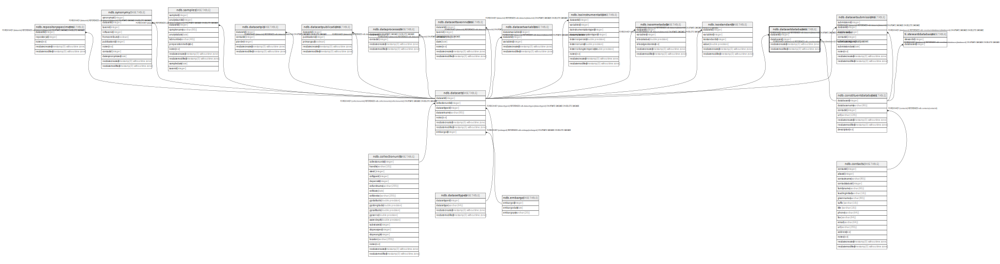

# ndb.datasetdatabases

## Description

## Columns

| # | Name            | Type                           | Default                      | Nullable | Children | Parents                                                 | Comment |
| - | --------------- | ------------------------------ | ---------------------------- | -------- | -------- | ------------------------------------------------------- | ------- |
| 1 | databaseid      | integer                        |                              | false    |          | [ndb.constituentdatabases](ndb.constituentdatabases.md) |         |
| 2 | datasetid       | integer                        |                              | false    |          | [ndb.datasets](ndb.datasets.md)                         |         |
| 3 | recdatecreated  | timestamp(0) without time zone | timezone('UTC'::text, now()) | false    |          |                                                         |         |
| 4 | recdatemodified | timestamp(0) without time zone |                              | false    |          |                                                         |         |

## Viewpoints

| Name                                     | Definition                                      |
| ---------------------------------------- | ----------------------------------------------- |
| [Dataset related tables](viewpoint-3.md) | Tables that help define and structure datasets. |

## Constraints

| # | Name                                     | Type        | Definition                                                                                                   |
| - | ---------------------------------------- | ----------- | ------------------------------------------------------------------------------------------------------------ |
| 1 | datasetdatabases_pkey                    | PRIMARY KEY | PRIMARY KEY (datasetid, databaseid)                                                                          |
| 2 | fk_datasetdatabases_constituentdatabases | FOREIGN KEY | FOREIGN KEY (databaseid) REFERENCES ndb.constituentdatabases(databaseid) ON UPDATE CASCADE ON DELETE CASCADE |
| 3 | fk_datasetdatabases_datasets             | FOREIGN KEY | FOREIGN KEY (datasetid) REFERENCES ndb.datasets(datasetid) ON UPDATE CASCADE ON DELETE CASCADE               |

## Indexes

| # | Name                          | Definition                                                                                                         |
| - | ----------------------------- | ------------------------------------------------------------------------------------------------------------------ |
| 1 | datasetdatabases_pkey         | CREATE UNIQUE INDEX datasetdatabases_pkey ON ndb.datasetdatabases USING btree (datasetid, databaseid)              |
| 2 | datasettimes                  | CREATE INDEX datasettimes ON ndb.datasetdatabases USING btree (recdatecreated)                                     |
| 3 | ix_datasetid_datasetdatabases | CREATE INDEX ix_datasetid_datasetdatabases ON ndb.datasetdatabases USING btree (datasetid) WITH (fillfactor='10')  |
| 4 | ix_projectid_datasetdatabases | CREATE INDEX ix_projectid_datasetdatabases ON ndb.datasetdatabases USING btree (databaseid) WITH (fillfactor='10') |

## Triggers

| # | Name                | Definition                                                                                                                                    |
| - | ------------------- | --------------------------------------------------------------------------------------------------------------------------------------------- |
| 1 | tr_sites_modifydate | CREATE TRIGGER tr_sites_modifydate BEFORE INSERT OR UPDATE ON ndb.datasetdatabases FOR EACH ROW EXECUTE FUNCTION ndb.update_recdatemodified() |

## Relations

---

> Generated by [tbls](https://github.com/k1LoW/tbls)