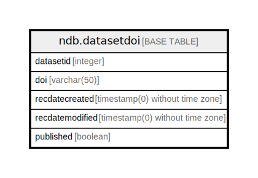

# ndb.datasetdoi

## Description

## Columns

| # | Name            | Type                           | Default                      | Nullable | Children | Parents | Comment |
| - | --------------- | ------------------------------ | ---------------------------- | -------- | -------- | ------- | ------- |
| 1 | datasetid       | integer                        |                              | false    |          |         |         |
| 2 | doi             | varchar(50)                    |                              | false    |          |         |         |
| 3 | published       | boolean                        | true                         | false    |          |         |         |
| 4 | recdatecreated  | timestamp(0) without time zone | timezone('UTC'::text, now()) | false    |          |         |         |
| 5 | recdatemodified | timestamp(0) without time zone |                              | false    |          |         |         |

## Viewpoints

| Name                                     | Definition                                      |
| ---------------------------------------- | ----------------------------------------------- |
| [Dataset related tables](viewpoint-3.md) | Tables that help define and structure datasets. |

## Constraints

| # | Name            | Type        | Definition                   |
| - | --------------- | ----------- | ---------------------------- |
| 1 | datasetdoi_pkey | PRIMARY KEY | PRIMARY KEY (datasetid, doi) |

## Indexes

| # | Name                         | Definition                                                                                        |
| - | ---------------------------- | ------------------------------------------------------------------------------------------------- |
| 1 | datasetdoi_pkey              | CREATE UNIQUE INDEX datasetdoi_pkey ON ndb.datasetdoi USING btree (datasetid, doi)                |
| 2 | idx_datasetdoi_datasetid     | CREATE INDEX idx_datasetdoi_datasetid ON ndb.datasetdoi USING btree (datasetid)                   |
| 3 | idx_datasetdoi_datasetid_doi | CREATE INDEX idx_datasetdoi_datasetid_doi ON ndb.datasetdoi USING btree (datasetid) INCLUDE (doi) |

## Triggers

| # | Name                | Definition                                                                                                                              |
| - | ------------------- | --------------------------------------------------------------------------------------------------------------------------------------- |
| 1 | tr_sites_modifydate | CREATE TRIGGER tr_sites_modifydate BEFORE INSERT OR UPDATE ON ndb.datasetdoi FOR EACH ROW EXECUTE FUNCTION ndb.update_recdatemodified() |

## Relations

---

> Generated by [tbls](https://github.com/k1LoW/tbls)