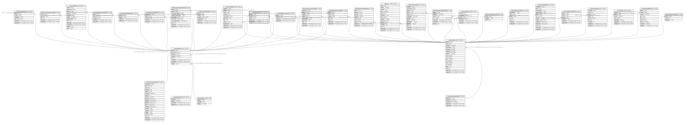

# ndb.datasetpis

## Description

## Columns

| # | Name            | Type                           | Default                      | Nullable | Children | Parents                         | Comment                                                       |
| - | --------------- | ------------------------------ | ---------------------------- | -------- | -------- | ------------------------------- | ------------------------------------------------------------- |
| 1 | contactid       | integer                        |                              | false    |          | [ndb.contacts](ndb.contacts.md) | Contact identification number. Field links to Contacts table. |
| 2 | datasetid       | integer                        |                              | false    |          | [ndb.datasets](ndb.datasets.md) | Dataset identification number. Field links to Dataset table.  |
| 3 | piorder         | integer                        |                              | true     |          |                                 | Order in which PIs are listed.                                |
| 4 | recdatecreated  | timestamp(0) without time zone | timezone('UTC'::text, now()) | false    |          |                                 |                                                               |
| 5 | recdatemodified | timestamp(0) without time zone |                              | false    |          |                                 |                                                               |

## Viewpoints

| Name                                     | Definition                                                       |
| ---------------------------------------- | ---------------------------------------------------------------- |
| [Dataset related tables](viewpoint-3.md) | Tables that help define and structure datasets.                  |
| [Contact related tables](viewpoint-4.md) | Tables that relate to people, or are connected to the contactid. |

## Constraints

| # | Name                   | Type        | Definition                                                                                     |
| - | ---------------------- | ----------- | ---------------------------------------------------------------------------------------------- |
| 1 | fk_datasetpis_contacts | FOREIGN KEY | FOREIGN KEY (contactid) REFERENCES ndb.contacts(contactid) ON UPDATE CASCADE                   |
| 2 | fk_datasetpis_datasets | FOREIGN KEY | FOREIGN KEY (datasetid) REFERENCES ndb.datasets(datasetid) ON UPDATE CASCADE ON DELETE CASCADE |

## Indexes

| # | Name                               | Definition                                                                                                    |
| - | ---------------------------------- | ------------------------------------------------------------------------------------------------------------- |
| 1 | idx_datasetpis_datasetid           | CREATE INDEX idx_datasetpis_datasetid ON ndb.datasetpis USING btree (datasetid)                               |
| 2 | idx_datasetpis_datasetid_contactid | CREATE INDEX idx_datasetpis_datasetid_contactid ON ndb.datasetpis USING btree (datasetid) INCLUDE (contactid) |
| 3 | ix_contactid_datasetpis            | CREATE INDEX ix_contactid_datasetpis ON ndb.datasetpis USING btree (contactid) WITH (fillfactor='10')         |
| 4 | ix_datasetid_datasetpis            | CREATE INDEX ix_datasetid_datasetpis ON ndb.datasetpis USING btree (datasetid) WITH (fillfactor='10')         |

## Triggers

| # | Name                | Definition                                                                                                                              |
| - | ------------------- | --------------------------------------------------------------------------------------------------------------------------------------- |
| 1 | tr_sites_modifydate | CREATE TRIGGER tr_sites_modifydate BEFORE INSERT OR UPDATE ON ndb.datasetpis FOR EACH ROW EXECUTE FUNCTION ndb.update_recdatemodified() |

## Relations

---

> Generated by [tbls](https://github.com/k1LoW/tbls)