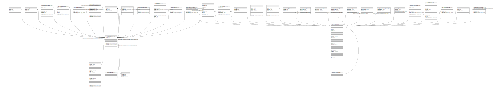

# ndb.datasetpublications

## Description

This table lists the publications for datasets.

## Columns

| # | Name            | Type                           | Default                      | Nullable | Children | Parents                                 | Comment                                                                  |
| - | --------------- | ------------------------------ | ---------------------------- | -------- | -------- | --------------------------------------- | ------------------------------------------------------------------------ |
| 1 | datasetid       | integer                        |                              | false    |          | [ndb.datasets](ndb.datasets.md)         | Dataset identification number. Field links to Dataset table.             |
| 2 | primarypub      | boolean                        |                              | true     |          |                                         | Is «True» if the publication is the primary publication for the dataset. |
| 3 | publicationid   | integer                        |                              | false    |          | [ndb.publications](ndb.publications.md) | Publication identification number. Field links to Publications table.    |
| 4 | recdatecreated  | timestamp(0) without time zone | timezone('UTC'::text, now()) | false    |          |                                         |                                                                          |
| 5 | recdatemodified | timestamp(0) without time zone |                              | false    |          |                                         |                                                                          |

## Viewpoints

| Name                                     | Definition                                      |
| ---------------------------------------- | ----------------------------------------------- |
| [Dataset related tables](viewpoint-3.md) | Tables that help define and structure datasets. |

## Constraints

| # | Name                                | Type        | Definition                                                                                     |
| - | ----------------------------------- | ----------- | ---------------------------------------------------------------------------------------------- |
| 1 | datasetpublications_pkey            | PRIMARY KEY | PRIMARY KEY (datasetid, publicationid)                                                         |
| 2 | fk_datasetpublications_datasets     | FOREIGN KEY | FOREIGN KEY (datasetid) REFERENCES ndb.datasets(datasetid) ON UPDATE CASCADE ON DELETE CASCADE |
| 3 | fk_datasetpublications_publications | FOREIGN KEY | FOREIGN KEY (publicationid) REFERENCES ndb.publications(publicationid)                         |

## Indexes

| # | Name                                 | Definition                                                                                                                      |
| - | ------------------------------------ | ------------------------------------------------------------------------------------------------------------------------------- |
| 1 | datasetpublications_pkey             | CREATE UNIQUE INDEX datasetpublications_pkey ON ndb.datasetpublications USING btree (datasetid, publicationid)                  |
| 2 | ix_datasetid_datasetpublications     | CREATE INDEX ix_datasetid_datasetpublications ON ndb.datasetpublications USING btree (datasetid) WITH (fillfactor='10')         |
| 3 | ix_publicationid_datasetpublications | CREATE INDEX ix_publicationid_datasetpublications ON ndb.datasetpublications USING btree (publicationid) WITH (fillfactor='10') |

## Triggers

| # | Name                | Definition                                                                                                                                       |
| - | ------------------- | ------------------------------------------------------------------------------------------------------------------------------------------------ |
| 1 | tr_sites_modifydate | CREATE TRIGGER tr_sites_modifydate BEFORE INSERT OR UPDATE ON ndb.datasetpublications FOR EACH ROW EXECUTE FUNCTION ndb.update_recdatemodified() |

## Relations

---

> Generated by [tbls](https://github.com/k1LoW/tbls)