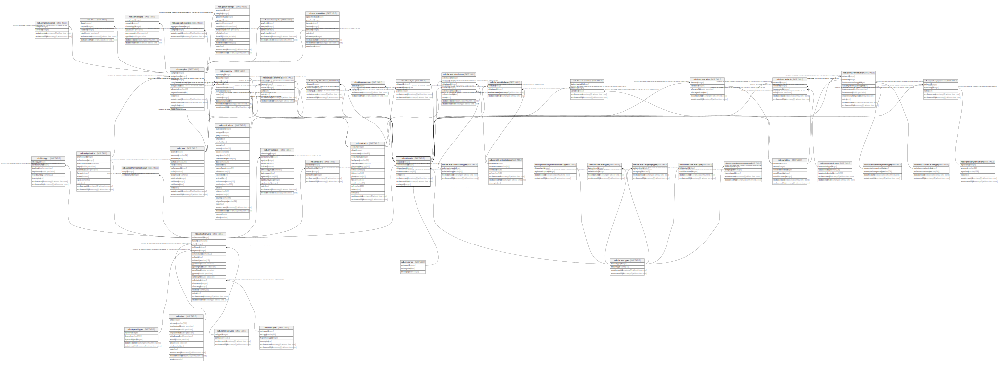

# ndb.datasets

## Description

This table stores the data for Datasets. A Dataset is the set of samples for a particular data type from a Collection Unit. A Collection Unit may have multiple Datasets for different data types, for example one dataset for pollen and another for plant macrofossils. Every Sample is assigned to a Dataset, and every Dataset is assigned to a Collection Unit. Samples from different Collection Units cannot be assigned to the same Dataset (although they may be assigned to Aggregate Datasets).

## Columns

| # | Name             | Type                           | Default                                         | Nullable | Children                                                                                                                                                                                                                                                                                                                                                                                                                                                                                                                                                                                              | Parents                                       | Comment                                                                           |
| - | ---------------- | ------------------------------ | ----------------------------------------------- | -------- | ----------------------------------------------------------------------------------------------------------------------------------------------------------------------------------------------------------------------------------------------------------------------------------------------------------------------------------------------------------------------------------------------------------------------------------------------------------------------------------------------------------------------------------------------------------------------------------------------------- | --------------------------------------------- | --------------------------------------------------------------------------------- |
| 1 | collectionunitid | integer                        |                                                 | false    |                                                                                                                                                                                                                                                                                                                                                                                                                                                                                                                                                                                                       | [ndb.collectionunits](ndb.collectionunits.md) | Collection Unit identification number. Field links to the CollectionUnits table.  |
| 2 | datasetid        | integer                        | nextval('ndb.seq_datasets_datasetid'::regclass) | false    | [ndb.dataprocessors](ndb.dataprocessors.md) [ndb.datasetdatabases](ndb.datasetdatabases.md) [ndb.datasetpis](ndb.datasetpis.md) [ndb.datasetpublications](ndb.datasetpublications.md) [ndb.datasetsubmissions](ndb.datasetsubmissions.md) [ndb.datasettaxonnotes](ndb.datasettaxonnotes.md) [ndb.datasetvariables](ndb.datasetvariables.md) [ndb.isoinstrumentation](ndb.isoinstrumentation.md) [ndb.isosrmetadata](ndb.isosrmetadata.md) [ndb.isostandards](ndb.isostandards.md) [ndb.repositoryspecimens](ndb.repositoryspecimens.md) [ndb.samples](ndb.samples.md) [ndb.synonymy](ndb.synonymy.md) |                                               | An arbitrary Dataset identification number.                                       |
| 3 | datasetname      | varchar(80)                    |                                                 | true     |                                                                                                                                                                                                                                                                                                                                                                                                                                                                                                                                                                                                       |                                               | Optional name for the Dataset.                                                    |
| 4 | datasettypeid    | integer                        |                                                 | false    |                                                                                                                                                                                                                                                                                                                                                                                                                                                                                                                                                                                                       | [ndb.datasettypes](ndb.datasettypes.md)       | Dataset Type identification number. Field links to the DatasetTypes lookup table. |
| 5 | embargoid        | integer                        |                                                 | true     |                                                                                                                                                                                                                                                                                                                                                                                                                                                                                                                                                                                                       | [ndb.embargo](ndb.embargo.md)                 |                                                                                   |
| 6 | notes            | text                           |                                                 | true     |                                                                                                                                                                                                                                                                                                                                                                                                                                                                                                                                                                                                       |                                               | Free form notes or comments about the Dataset.                                    |
| 7 | recdatecreated   | timestamp(0) without time zone | timezone('UTC'::text, now())                    | false    |                                                                                                                                                                                                                                                                                                                                                                                                                                                                                                                                                                                                       |                                               |                                                                                   |
| 8 | recdatemodified  | timestamp(0) without time zone |                                                 | false    |                                                                                                                                                                                                                                                                                                                                                                                                                                                                                                                                                                                                       |                                               |                                                                                   |

## Viewpoints

| Name                                     | Definition                                      |
| ---------------------------------------- | ----------------------------------------------- |
| [Dataset related tables](viewpoint-3.md) | Tables that help define and structure datasets. |

## Constraints

| # | Name                        | Type        | Definition                                                                                                          |
| - | --------------------------- | ----------- | ------------------------------------------------------------------------------------------------------------------- |
| 1 | datasets_pkey               | PRIMARY KEY | PRIMARY KEY (datasetid)                                                                                             |
| 2 | fk_datasets_collectionunits | FOREIGN KEY | FOREIGN KEY (collectionunitid) REFERENCES ndb.collectionunits(collectionunitid) ON UPDATE CASCADE ON DELETE CASCADE |
| 3 | fk_datasets_datasettypes    | FOREIGN KEY | FOREIGN KEY (datasettypeid) REFERENCES ndb.datasettypes(datasettypeid) ON UPDATE CASCADE ON DELETE CASCADE          |
| 4 | fk_datasets_embargo         | FOREIGN KEY | FOREIGN KEY (embargoid) REFERENCES ndb.embargo(embargoid) ON UPDATE CASCADE ON DELETE CASCADE                       |

## Indexes

| # | Name                         | Definition                                                                                                                 |
| - | ---------------------------- | -------------------------------------------------------------------------------------------------------------------------- |
| 1 | datasets_pkey                | CREATE UNIQUE INDEX datasets_pkey ON ndb.datasets USING btree (datasetid)                                                  |
| 2 | idx_datasets_collectionunit  | CREATE INDEX idx_datasets_collectionunit ON ndb.datasets USING btree (collectionunitid) INCLUDE (datasetid, datasettypeid) |
| 3 | ix_collectionunitid_datasets | CREATE INDEX ix_collectionunitid_datasets ON ndb.datasets USING btree (collectionunitid) WITH (fillfactor='10')            |
| 4 | ix_datasettypeid_datasets    | CREATE INDEX ix_datasettypeid_datasets ON ndb.datasets USING btree (datasettypeid) WITH (fillfactor='10')                  |

## Triggers

| # | Name                | Definition                                                                                                                            |
| - | ------------------- | ------------------------------------------------------------------------------------------------------------------------------------- |
| 1 | tr_sites_modifydate | CREATE TRIGGER tr_sites_modifydate BEFORE INSERT OR UPDATE ON ndb.datasets FOR EACH ROW EXECUTE FUNCTION ndb.update_recdatemodified() |

## Relations

---

> Generated by [tbls](https://github.com/k1LoW/tbls)