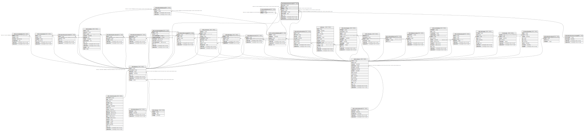

# ndb.datasetsubmissions

## Description

Submissions to the database are of Datasets. Submissions may be original submissions, resubmissions, compilations from other databases, or recompilations. See the description of the DatasetSubmissionTypes table.

## Columns

| # | Name             | Type                           | Default                                                      | Nullable | Children | Parents                                                     | Comment                                                                                                                                                                                                                                                                                    |
| - | ---------------- | ------------------------------ | ------------------------------------------------------------ | -------- | -------- | ----------------------------------------------------------- | ------------------------------------------------------------------------------------------------------------------------------------------------------------------------------------------------------------------------------------------------------------------------------------------ |
| 1 | submissionid     | integer                        | nextval('ndb.seq_datasetsubmissions_submissionid'::regclass) | false    |          |                                                             | An arbitrary submission identification number.                                                                                                                                                                                                                                             |
| 2 | datasetid        | integer                        |                                                              | false    |          | [ndb.datasets](ndb.datasets.md)                             | Dataset identification number. Field links to the Datasets table. Datasets may occur multiple times in this table (e.g. once for the original compilation into a different database and a second time for the recompilation into Neotoma).                                                 |
| 3 | databaseid       | integer                        |                                                              | true     |          | [ndb.constituentdatabases](ndb.constituentdatabases.md)     |                                                                                                                                                                                                                                                                                            |
| 4 | contactid        | integer                        |                                                              | true     |          | [ndb.contacts](ndb.contacts.md)                             | Contact identification number. Field links to the Contacts table. The Contact is the person who submitted, resubmitted, compiled, or recompiled the data. This person is not necessarily the Dataset PI; it is the person who submitted the data or compiled the data from the literature. |
| 5 | submissiontypeid | integer                        |                                                              | true     |          | [ndb.datasetsubmissiontypes](ndb.datasetsubmissiontypes.md) | Submission Type identification number. Field links to the DatasetSubmissionsType table.                                                                                                                                                                                                    |
| 6 | submissiondate   | date                           |                                                              | true     |          |                                                             | Date of the submission, resubmission, compilation, or recompilation.                                                                                                                                                                                                                       |
| 7 | notes            | text                           |                                                              | true     |          |                                                             | Free form notes or comments about the submission.                                                                                                                                                                                                                                          |
| 8 | recdatecreated   | timestamp(0) without time zone | timezone('UTC'::text, now())                                 | false    |          |                                                             |                                                                                                                                                                                                                                                                                            |
| 9 | recdatemodified  | timestamp(0) without time zone |                                                              | false    |          |                                                             |                                                                                                                                                                                                                                                                                            |

## Constraints

| # | Name                                         | Type        | Definition                                                                                                                 |
| - | -------------------------------------------- | ----------- | -------------------------------------------------------------------------------------------------------------------------- |
| 1 | fk_datasetsubmissions_constituentdatabases   | FOREIGN KEY | FOREIGN KEY (databaseid) REFERENCES ndb.constituentdatabases(databaseid) ON UPDATE CASCADE ON DELETE CASCADE               |
| 2 | fk_datasetsubmissions_contacts               | FOREIGN KEY | FOREIGN KEY (contactid) REFERENCES ndb.contacts(contactid) ON UPDATE CASCADE                                               |
| 3 | fk_datasetsubmissions_datasets               | FOREIGN KEY | FOREIGN KEY (datasetid) REFERENCES ndb.datasets(datasetid) ON UPDATE CASCADE ON DELETE CASCADE                             |
| 4 | datasetsubmissions_pkey                      | PRIMARY KEY | PRIMARY KEY (submissionid)                                                                                                 |
| 5 | fk_datasetsubmissions_datasetsubmissiontypes | FOREIGN KEY | FOREIGN KEY (submissiontypeid) REFERENCES ndb.datasetsubmissiontypes(submissiontypeid) ON UPDATE CASCADE ON DELETE CASCADE |

## Indexes

| # | Name                            | Definition                                                                                                             |
| - | ------------------------------- | ---------------------------------------------------------------------------------------------------------------------- |
| 1 | datasetsubmissions_pkey         | CREATE UNIQUE INDEX datasetsubmissions_pkey ON ndb.datasetsubmissions USING btree (submissionid)                       |
| 2 | ix_datasetid_datasetsubmissions | CREATE INDEX ix_datasetid_datasetsubmissions ON ndb.datasetsubmissions USING btree (datasetid) WITH (fillfactor='10')  |
| 3 | ix_projectid_datasetsubmissions | CREATE INDEX ix_projectid_datasetsubmissions ON ndb.datasetsubmissions USING btree (databaseid) WITH (fillfactor='10') |

## Triggers

| # | Name                | Definition                                                                                                                                      |
| - | ------------------- | ----------------------------------------------------------------------------------------------------------------------------------------------- |
| 1 | tr_sites_modifydate | CREATE TRIGGER tr_sites_modifydate BEFORE INSERT OR UPDATE ON ndb.datasetsubmissions FOR EACH ROW EXECUTE FUNCTION ndb.update_recdatemodified() |

## Relations

---

> Generated by [tbls](https://github.com/k1LoW/tbls)