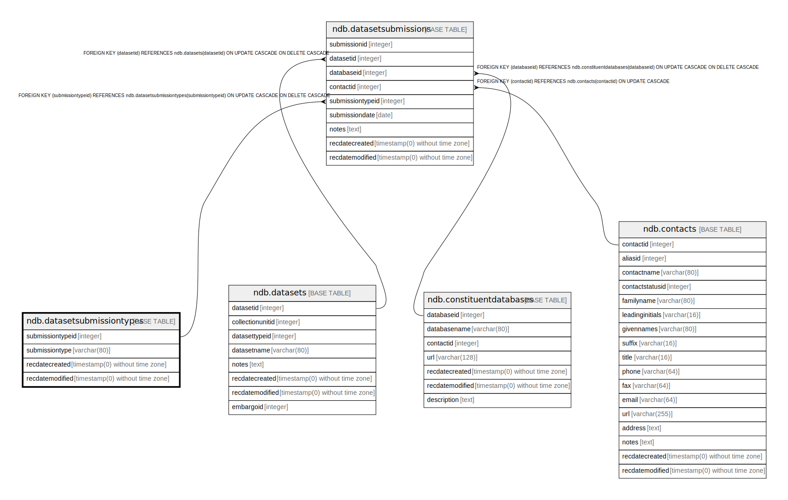

# ndb.datasetsubmissiontypes

## Description

Lookup table of Dataset Submission Types. Table is referenced by the DatasetSubmissions table.

## Columns

| # | Name             | Type                           | Default                                                              | Nullable | Children                                            | Parents | Comment                                                                                                                                                                                                                                                                                                                                                                                                                                                                                                                |
| - | ---------------- | ------------------------------ | -------------------------------------------------------------------- | -------- | --------------------------------------------------- | ------- | ---------------------------------------------------------------------------------------------------------------------------------------------------------------------------------------------------------------------------------------------------------------------------------------------------------------------------------------------------------------------------------------------------------------------------------------------------------------------------------------------------------------------- |
| 1 | recdatecreated   | timestamp(0) without time zone | timezone('UTC'::text, now())                                         | false    |                                                     |         |                                                                                                                                                                                                                                                                                                                                                                                                                                                                                                                        |
| 2 | recdatemodified  | timestamp(0) without time zone |                                                                      | false    |                                                     |         |                                                                                                                                                                                                                                                                                                                                                                                                                                                                                                                        |
| 3 | submissiontype   | varchar(80)                    |                                                                      | false    |                                                     |         | Type of submission. The database has the following types: Original submission from data contributor Resubmission or revision from data contributor Compilation into a flat file database Compilation into a another relational database Recompilation or revisions to a another relational database Compilation into Neotoma from another database Recompilation into Neotoma from another database Compilation into Neotoma from primary source Recompilation into or revisions to Neotoma |
| 4 | submissiontypeid | integer                        | nextval('ndb.seq_datasetsubmissiontypes_submissiontypeid'::regclass) | false    | [ndb.datasetsubmissions](ndb.datasetsubmissions.md) |         | An arbitrary Submission Type identification number.                                                                                                                                                                                                                                                                                                                                                                                                                                                                    |

## Viewpoints

| Name                                     | Definition                                      |
| ---------------------------------------- | ----------------------------------------------- |
| [Dataset related tables](viewpoint-3.md) | Tables that help define and structure datasets. |

## Constraints

| # | Name                        | Type        | Definition                     |
| - | --------------------------- | ----------- | ------------------------------ |
| 1 | datasetsubmissiontypes_pkey | PRIMARY KEY | PRIMARY KEY (submissiontypeid) |

## Indexes

| # | Name                        | Definition                                                                                                   |
| - | --------------------------- | ------------------------------------------------------------------------------------------------------------ |
| 1 | datasetsubmissiontypes_pkey | CREATE UNIQUE INDEX datasetsubmissiontypes_pkey ON ndb.datasetsubmissiontypes USING btree (submissiontypeid) |

## Triggers

| # | Name                | Definition                                                                                                                                          |
| - | ------------------- | --------------------------------------------------------------------------------------------------------------------------------------------------- |
| 1 | tr_sites_modifydate | CREATE TRIGGER tr_sites_modifydate BEFORE INSERT OR UPDATE ON ndb.datasetsubmissiontypes FOR EACH ROW EXECUTE FUNCTION ndb.update_recdatemodified() |

## Relations

---

> Generated by [tbls](https://github.com/k1LoW/tbls)