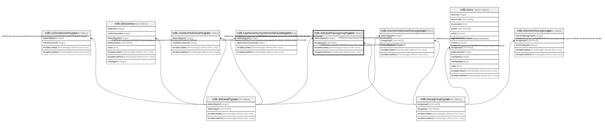

# ndb.datasettaxagrouptypes

## Description

## Columns

| # | Name            | Type                           | Default                      | Nullable | Children | Parents                                     | Comment |
| - | --------------- | ------------------------------ | ---------------------------- | -------- | -------- | ------------------------------------------- | ------- |
| 1 | datasettypeid   | integer                        |                              | false    |          | [ndb.datasettypes](ndb.datasettypes.md)     |         |
| 2 | recdatecreated  | timestamp(0) without time zone | timezone('UTC'::text, now()) | false    |          |                                             |         |
| 3 | recdatemodified | timestamp(0) without time zone |                              | false    |          |                                             |         |
| 4 | taxagroupid     | varchar(3)                     |                              | false    |          | [ndb.taxagrouptypes](ndb.taxagrouptypes.md) |         |

## Viewpoints

| Name                                      | Definition                                      |
| ----------------------------------------- | ----------------------------------------------- |
| [Controlled Vocabularies](viewpoint-0.md) | Tables with controlled vocabularies.            |
| [Dataset related tables](viewpoint-3.md)  | Tables that help define and structure datasets. |

## Constraints

| # | Name                                    | Type        | Definition                                                                                                 |
| - | --------------------------------------- | ----------- | ---------------------------------------------------------------------------------------------------------- |
| 1 | datasettaxagrouptypes_pkey              | PRIMARY KEY | PRIMARY KEY (datasettypeid, taxagroupid)                                                                   |
| 2 | fk_datasettaxagrouptypes_datasettypes   | FOREIGN KEY | FOREIGN KEY (datasettypeid) REFERENCES ndb.datasettypes(datasettypeid) ON UPDATE CASCADE ON DELETE CASCADE |
| 3 | fk_datasettaxagrouptypes_taxagrouptypes | FOREIGN KEY | FOREIGN KEY (taxagroupid) REFERENCES ndb.taxagrouptypes(taxagroupid) ON UPDATE CASCADE ON DELETE CASCADE   |

## Indexes

| # | Name                       | Definition                                                                                                           |
| - | -------------------------- | -------------------------------------------------------------------------------------------------------------------- |
| 1 | datasettaxagrouptypes_pkey | CREATE UNIQUE INDEX datasettaxagrouptypes_pkey ON ndb.datasettaxagrouptypes USING btree (datasettypeid, taxagroupid) |

## Triggers

| # | Name                | Definition                                                                                                                                         |
| - | ------------------- | -------------------------------------------------------------------------------------------------------------------------------------------------- |
| 1 | tr_sites_modifydate | CREATE TRIGGER tr_sites_modifydate BEFORE INSERT OR UPDATE ON ndb.datasettaxagrouptypes FOR EACH ROW EXECUTE FUNCTION ndb.update_recdatemodified() |

## Relations

---

> Generated by [tbls](https://github.com/k1LoW/tbls)