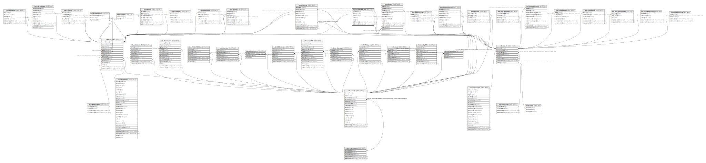

# ndb.datasettaxonnotes

## Description

## Columns

| # | Name            | Type                           | Default                      | Nullable | Children | Parents                         | Comment |
| - | --------------- | ------------------------------ | ---------------------------- | -------- | -------- | ------------------------------- | ------- |
| 1 | contactid       | integer                        |                              | false    |          | [ndb.contacts](ndb.contacts.md) |         |
| 2 | datasetid       | integer                        |                              | false    |          | [ndb.datasets](ndb.datasets.md) |         |
| 3 | date            | date                           |                              | false    |          |                                 |         |
| 4 | notes           | text                           |                              | false    |          |                                 |         |
| 5 | recdatecreated  | timestamp(0) without time zone | timezone('UTC'::text, now()) | false    |          |                                 |         |
| 6 | recdatemodified | timestamp(0) without time zone |                              | false    |          |                                 |         |
| 7 | taxonid         | integer                        |                              | false    |          | [ndb.taxa](ndb.taxa.md)         |         |

## Viewpoints

| Name                                     | Definition                                                       |
| ---------------------------------------- | ---------------------------------------------------------------- |
| [Dataset related tables](viewpoint-3.md) | Tables that help define and structure datasets.                  |
| [Contact related tables](viewpoint-4.md) | Tables that relate to people, or are connected to the contactid. |

## Constraints

| # | Name                          | Type        | Definition                                                                                     |
| - | ----------------------------- | ----------- | ---------------------------------------------------------------------------------------------- |
| 1 | datasettaxonnotes_pkey        | PRIMARY KEY | PRIMARY KEY (datasetid, taxonid)                                                               |
| 2 | fk_datasettaxonnotes_contacts | FOREIGN KEY | FOREIGN KEY (contactid) REFERENCES ndb.contacts(contactid)                                     |
| 3 | fk_datasettaxonnotes_datasets | FOREIGN KEY | FOREIGN KEY (datasetid) REFERENCES ndb.datasets(datasetid) ON UPDATE CASCADE ON DELETE CASCADE |
| 4 | fk_datasettaxonnotes_taxa     | FOREIGN KEY | FOREIGN KEY (taxonid) REFERENCES ndb.taxa(taxonid) ON UPDATE CASCADE ON DELETE CASCADE         |

## Indexes

| # | Name                   | Definition                                                                                           |
| - | ---------------------- | ---------------------------------------------------------------------------------------------------- |
| 1 | datasettaxonnotes_pkey | CREATE UNIQUE INDEX datasettaxonnotes_pkey ON ndb.datasettaxonnotes USING btree (datasetid, taxonid) |

## Triggers

| # | Name                | Definition                                                                                                                                     |
| - | ------------------- | ---------------------------------------------------------------------------------------------------------------------------------------------- |
| 1 | tr_sites_modifydate | CREATE TRIGGER tr_sites_modifydate BEFORE INSERT OR UPDATE ON ndb.datasettaxonnotes FOR EACH ROW EXECUTE FUNCTION ndb.update_recdatemodified() |

## Relations

---

> Generated by [tbls](https://github.com/k1LoW/tbls)