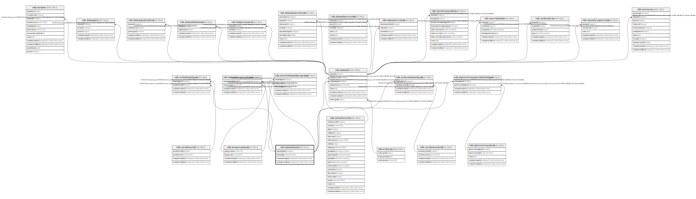

# ndb.datasettypes

## Description

Lookup table for Dataset Types. Table is referenced by the Datasets table.

## Columns

| # | Name            | Type                           | Default                                                 | Nullable | Children                                                                                                                                                                                                                                                                                                                                      | Parents | Comment                                                                                                                                          |
| - | --------------- | ------------------------------ | ------------------------------------------------------- | -------- | --------------------------------------------------------------------------------------------------------------------------------------------------------------------------------------------------------------------------------------------------------------------------------------------------------------------------------------------- | ------- | ------------------------------------------------------------------------------------------------------------------------------------------------ |
| 1 | datasettype     | varchar(64)                    |                                                         | false    |                                                                                                                                                                                                                                                                                                                                               |         | The Dataset type, including the following: geochronologic loss-on-ignition pollen plant macrofossils vertebrate fauna mollusks |
| 2 | datasettypeid   | integer                        | nextval('ndb.seq_datasettypes_datasettypeid'::regclass) | false    | [ndb.contextsdatasettypes](ndb.contextsdatasettypes.md) [ndb.datasets](ndb.datasets.md) [ndb.datasettaxagrouptypes](ndb.datasettaxagrouptypes.md) [ndb.elementdatasettaxagroups](ndb.elementdatasettaxagroups.md) [ndb.taphonomicsystemsdatasettypes](ndb.taphonomicsystemsdatasettypes.md) [ndb.unitsdatasettypes](ndb.unitsdatasettypes.md) |         | An arbitrary Dataset Type identification number.                                                                                                 |
| 3 | recdatecreated  | timestamp(0) without time zone | timezone('UTC'::text, now())                            | false    |                                                                                                                                                                                                                                                                                                                                               |         |                                                                                                                                                  |
| 4 | recdatemodified | timestamp(0) without time zone |                                                         | false    |                                                                                                                                                                                                                                                                                                                                               |         |                                                                                                                                                  |

## Viewpoints

| Name                                     | Definition                                      |
| ---------------------------------------- | ----------------------------------------------- |
| [Dataset related tables](viewpoint-3.md) | Tables that help define and structure datasets. |

## Constraints

| # | Name              | Type        | Definition                  |
| - | ----------------- | ----------- | --------------------------- |
| 1 | datasettypes_pkey | PRIMARY KEY | PRIMARY KEY (datasettypeid) |

## Indexes

| # | Name              | Definition                                                                            |
| - | ----------------- | ------------------------------------------------------------------------------------- |
| 1 | datasettypes_pkey | CREATE UNIQUE INDEX datasettypes_pkey ON ndb.datasettypes USING btree (datasettypeid) |

## Triggers

| # | Name                | Definition                                                                                                                                |
| - | ------------------- | ----------------------------------------------------------------------------------------------------------------------------------------- |
| 1 | tr_sites_modifydate | CREATE TRIGGER tr_sites_modifydate BEFORE INSERT OR UPDATE ON ndb.datasettypes FOR EACH ROW EXECUTE FUNCTION ndb.update_recdatemodified() |

## Relations

---

> Generated by [tbls](https://github.com/k1LoW/tbls)