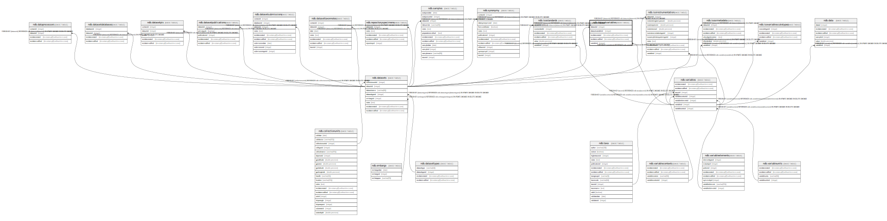

# ndb.datasetvariables

## Description

## Columns

| # | Name              | Type                           | Default                                                         | Nullable | Children | Parents                           | Comment |
| - | ----------------- | ------------------------------ | --------------------------------------------------------------- | -------- | -------- | --------------------------------- | ------- |
| 1 | datasetvariableid | integer                        | nextval('ndb.seq_datasetvariables_datasetvariableid'::regclass) | false    |          |                                   |         |
| 2 | datasetid         | integer                        |                                                                 | false    |          | [ndb.datasets](ndb.datasets.md)   |         |
| 3 | variableid        | integer                        |                                                                 | false    |          | [ndb.variables](ndb.variables.md) |         |
| 4 | recdatecreated    | timestamp(0) without time zone | timezone('UTC'::text, now())                                    | false    |          |                                   |         |
| 5 | recdatemodified   | timestamp(0) without time zone |                                                                 | false    |          |                                   |         |

## Constraints

| # | Name                          | Type        | Definition                                                                                        |
| - | ----------------------------- | ----------- | ------------------------------------------------------------------------------------------------- |
| 1 | fk_datasetvariables_datasets  | FOREIGN KEY | FOREIGN KEY (datasetid) REFERENCES ndb.datasets(datasetid) ON UPDATE CASCADE ON DELETE CASCADE    |
| 2 | datasetvariables_pkey         | PRIMARY KEY | PRIMARY KEY (datasetvariableid)                                                                   |
| 3 | fk_datasetvariables_variables | FOREIGN KEY | FOREIGN KEY (variableid) REFERENCES ndb.variables(variableid) ON UPDATE CASCADE ON DELETE CASCADE |

## Indexes

| # | Name                  | Definition                                                                                        |
| - | --------------------- | ------------------------------------------------------------------------------------------------- |
| 1 | datasetvariables_pkey | CREATE UNIQUE INDEX datasetvariables_pkey ON ndb.datasetvariables USING btree (datasetvariableid) |

## Triggers

| # | Name                | Definition                                                                                                                                    |
| - | ------------------- | --------------------------------------------------------------------------------------------------------------------------------------------- |
| 1 | tr_sites_modifydate | CREATE TRIGGER tr_sites_modifydate BEFORE INSERT OR UPDATE ON ndb.datasetvariables FOR EACH ROW EXECUTE FUNCTION ndb.update_recdatemodified() |

## Relations

---

> Generated by [tbls](https://github.com/k1LoW/tbls)