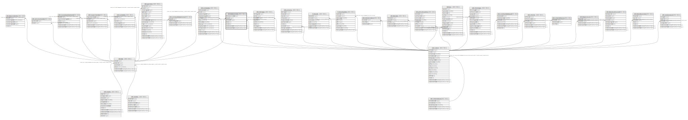

# ndb.datataxonnotes

## Description

## Columns

| # | Name             | Type                           | Default                                                      | Nullable | Children | Parents                         | Comment |
| - | ---------------- | ------------------------------ | ------------------------------------------------------------ | -------- | -------- | ------------------------------- | ------- |
| 1 | contactid        | integer                        |                                                              | false    |          | [ndb.contacts](ndb.contacts.md) |         |
| 2 | dataid           | integer                        |                                                              | false    |          | [ndb.data](ndb.data.md)         |         |
| 3 | datataxonnotesid | integer                        | nextval('ndb.seq_datataxonnotes_datataxonnotesid'::regclass) | false    |          |                                 |         |
| 4 | date             | date                           |                                                              | false    |          |                                 |         |
| 5 | notes            | text                           |                                                              | false    |          |                                 |         |
| 6 | recdatecreated   | timestamp(0) without time zone | timezone('UTC'::text, now())                                 | false    |          |                                 |         |
| 7 | recdatemodified  | timestamp(0) without time zone |                                                              | false    |          |                                 |         |

## Viewpoints

| Name                                     | Definition                                                       |
| ---------------------------------------- | ---------------------------------------------------------------- |
| [Contact related tables](viewpoint-4.md) | Tables that relate to people, or are connected to the contactid. |

## Constraints

| # | Name                       | Type        | Definition                                                                           |
| - | -------------------------- | ----------- | ------------------------------------------------------------------------------------ |
| 1 | datataxonnotes_pkey        | PRIMARY KEY | PRIMARY KEY (datataxonnotesid)                                                       |
| 2 | fk_datataxonnotes_contacts | FOREIGN KEY | FOREIGN KEY (contactid) REFERENCES ndb.contacts(contactid)                           |
| 3 | fk_datataxonnotes_data     | FOREIGN KEY | FOREIGN KEY (dataid) REFERENCES ndb.data(dataid) ON UPDATE CASCADE ON DELETE CASCADE |

## Indexes

| # | Name                | Definition                                                                                   |
| - | ------------------- | -------------------------------------------------------------------------------------------- |
| 1 | datataxonnotes_pkey | CREATE UNIQUE INDEX datataxonnotes_pkey ON ndb.datataxonnotes USING btree (datataxonnotesid) |

## Triggers

| # | Name                | Definition                                                                                                                                  |
| - | ------------------- | ------------------------------------------------------------------------------------------------------------------------------------------- |
| 1 | tr_sites_modifydate | CREATE TRIGGER tr_sites_modifydate BEFORE INSERT OR UPDATE ON ndb.datataxonnotes FOR EACH ROW EXECUTE FUNCTION ndb.update_recdatemodified() |

## Relations

---

> Generated by [tbls](https://github.com/k1LoW/tbls)