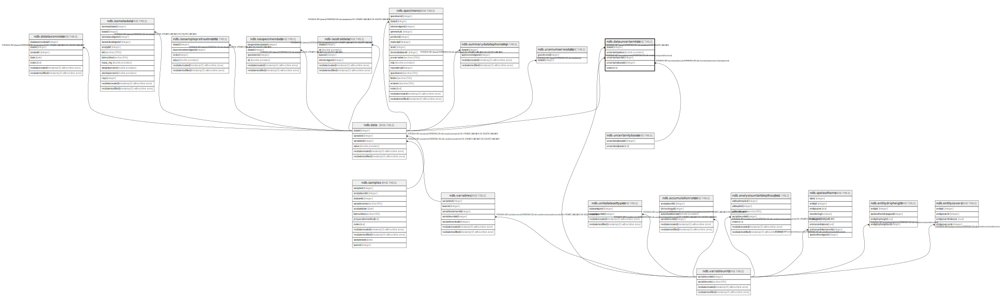

# ndb.datauncertainties

## Description

## Columns

| # | Name               | Type             | Default | Nullable | Children | Parents                                         | Comment |
| - | ------------------ | ---------------- | ------- | -------- | -------- | ----------------------------------------------- | ------- |
| 1 | dataid             | integer          |         | true     |          | [ndb.data](ndb.data.md)                         |         |
| 2 | notes              | text             |         | true     |          |                                                 |         |
| 3 | uncertaintybasisid | integer          |         | true     |          | [ndb.uncertaintybases](ndb.uncertaintybases.md) |         |
| 4 | uncertaintyunitid  | integer          |         | true     |          | [ndb.variableunits](ndb.variableunits.md)       |         |
| 5 | uncertaintyvalue   | double precision |         | true     |          |                                                 |         |

## Constraints

| # | Name                                      | Type        | Definition                                                                           |
| - | ----------------------------------------- | ----------- | ------------------------------------------------------------------------------------ |
| 1 | datauncertainties_dataid_fkey             | FOREIGN KEY | FOREIGN KEY (dataid) REFERENCES ndb.data(dataid) ON DELETE CASCADE                   |
| 2 | datauncertainties_uncertaintybasisid_fkey | FOREIGN KEY | FOREIGN KEY (uncertaintybasisid) REFERENCES ndb.uncertaintybases(uncertaintybasisid) |
| 3 | datauncertainties_uncertaintyunitid_fkey  | FOREIGN KEY | FOREIGN KEY (uncertaintyunitid) REFERENCES ndb.variableunits(variableunitsid)        |
| 4 | uniqueentryvalue                          | UNIQUE      | UNIQUE (dataid, uncertaintyunitid, uncertaintybasisid)                               |

## Indexes

| # | Name             | Definition                                                                                                                |
| - | ---------------- | ------------------------------------------------------------------------------------------------------------------------- |
| 1 | uniqueentryvalue | CREATE UNIQUE INDEX uniqueentryvalue ON ndb.datauncertainties USING btree (dataid, uncertaintyunitid, uncertaintybasisid) |

## Relations

---

> Generated by [tbls](https://github.com/k1LoW/tbls)