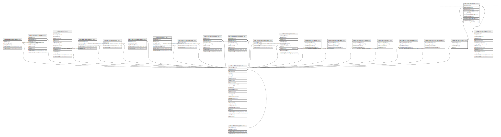

# ndb.decayconstants

## Description

## Columns

| # | Name            | Type    | Default                                                     | Nullable | Children                                  | Parents                                 | Comment |
| - | --------------- | ------- | ----------------------------------------------------------- | -------- | ----------------------------------------- | --------------------------------------- | ------- |
| 1 | decayconstant   | text    |                                                             | true     |                                           |                                         |         |
| 2 | decayconstantid | integer | nextval('ndb.decayconstants_decayconstantid_seq'::regclass) | false    | [ndb.uraniumseries](ndb.uraniumseries.md) |                                         |         |
| 3 | notes           | text    |                                                             | true     |                                           |                                         |         |
| 4 | publicationid   | integer |                                                             | true     |                                           | [ndb.publications](ndb.publications.md) |         |

## Constraints

| # | Name                              | Type        | Definition                                                             |
| - | --------------------------------- | ----------- | ---------------------------------------------------------------------- |
| 1 | decayconstants_pkey               | PRIMARY KEY | PRIMARY KEY (decayconstantid)                                          |
| 2 | decayconstants_publicationid_fkey | FOREIGN KEY | FOREIGN KEY (publicationid) REFERENCES ndb.publications(publicationid) |

## Indexes

| # | Name                | Definition                                                                                  |
| - | ------------------- | ------------------------------------------------------------------------------------------- |
| 1 | decayconstants_pkey | CREATE UNIQUE INDEX decayconstants_pkey ON ndb.decayconstants USING btree (decayconstantid) |

## Relations

---

> Generated by [tbls](https://github.com/k1LoW/tbls)