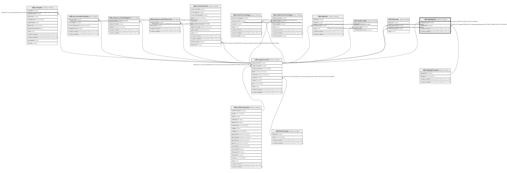

# ndb.depagents

## Description

Deposition Agents for Analysis Units. Individual Analysis Units may be listed multiple times with different Deposition Agents.

## Columns

| # | Name            | Type                           | Default                      | Nullable | Children | Parents                                   | Comment                                                                     |
| - | --------------- | ------------------------------ | ---------------------------- | -------- | -------- | ----------------------------------------- | --------------------------------------------------------------------------- |
| 1 | analysisunitid  | integer                        |                              | false    |          | [ndb.analysisunits](ndb.analysisunits.md) | Analysis Unit identification number. Field links to AnalysisUnits table.    |
| 2 | depagentid      | integer                        |                              | false    |          | [ndb.depagenttypes](ndb.depagenttypes.md) | Deposition Agent identification number. Field links to DepAgentTypes table. |
| 3 | recdatecreated  | timestamp(0) without time zone | timezone('UTC'::text, now()) | false    |          |                                           |                                                                             |
| 4 | recdatemodified | timestamp(0) without time zone |                              | false    |          |                                           |                                                                             |

## Constraints

| # | Name                       | Type        | Definition                                                                                                    |
| - | -------------------------- | ----------- | ------------------------------------------------------------------------------------------------------------- |
| 1 | fk_depagents_analysisunits | FOREIGN KEY | FOREIGN KEY (analysisunitid) REFERENCES ndb.analysisunits(analysisunitid) ON UPDATE CASCADE ON DELETE CASCADE |
| 2 | depagents_pkey             | PRIMARY KEY | PRIMARY KEY (analysisunitid, depagentid)                                                                      |
| 3 | fk_depagents_depagenttypes | FOREIGN KEY | FOREIGN KEY (depagentid) REFERENCES ndb.depagenttypes(depagentid) ON UPDATE CASCADE ON DELETE CASCADE         |

## Indexes

| # | Name                        | Definition                                                                                                    |
| - | --------------------------- | ------------------------------------------------------------------------------------------------------------- |
| 1 | depagents_pkey              | CREATE UNIQUE INDEX depagents_pkey ON ndb.depagents USING btree (analysisunitid, depagentid)                  |
| 2 | ix_analysisunitid_depagents | CREATE INDEX ix_analysisunitid_depagents ON ndb.depagents USING btree (analysisunitid) WITH (fillfactor='10') |
| 3 | ix_depagentid_depagents     | CREATE INDEX ix_depagentid_depagents ON ndb.depagents USING btree (depagentid) WITH (fillfactor='10')         |

## Triggers

| # | Name                | Definition                                                                                                                             |
| - | ------------------- | -------------------------------------------------------------------------------------------------------------------------------------- |
| 1 | tr_sites_modifydate | CREATE TRIGGER tr_sites_modifydate BEFORE INSERT OR UPDATE ON ndb.depagents FOR EACH ROW EXECUTE FUNCTION ndb.update_recdatemodified() |

## Relations

---

> Generated by [tbls](https://github.com/k1LoW/tbls)