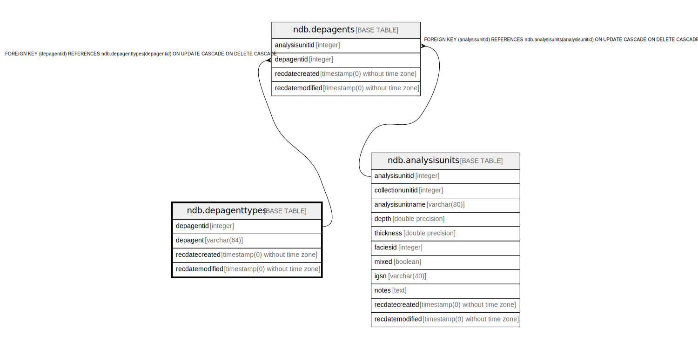

# ndb.depagenttypes

## Description

Lookup table of Depositional Agents. Table is referenced by the DepAgents table.

## Columns

| # | Name            | Type                           | Default                                               | Nullable | Children                          | Parents | Comment                                                |
| - | --------------- | ------------------------------ | ----------------------------------------------------- | -------- | --------------------------------- | ------- | ------------------------------------------------------ |
| 1 | depagent        | varchar(64)                    |                                                       | true     |                                   |         | Depositional Agent.                                    |
| 2 | depagentid      | integer                        | nextval('ndb.seq_depagenttypes_depagentid'::regclass) | false    | [ndb.depagents](ndb.depagents.md) |         | An arbitrary Depositional Agent identification number. |
| 3 | recdatecreated  | timestamp(0) without time zone | timezone('UTC'::text, now())                          | false    |                                   |         |                                                        |
| 4 | recdatemodified | timestamp(0) without time zone |                                                       | false    |                                   |         |                                                        |

## Constraints

| # | Name               | Type        | Definition               |
| - | ------------------ | ----------- | ------------------------ |
| 1 | depagenttypes_pkey | PRIMARY KEY | PRIMARY KEY (depagentid) |

## Indexes

| # | Name               | Definition                                                                           |
| - | ------------------ | ------------------------------------------------------------------------------------ |
| 1 | depagenttypes_pkey | CREATE UNIQUE INDEX depagenttypes_pkey ON ndb.depagenttypes USING btree (depagentid) |

## Triggers

| # | Name                | Definition                                                                                                                                 |
| - | ------------------- | ------------------------------------------------------------------------------------------------------------------------------------------ |
| 1 | tr_sites_modifydate | CREATE TRIGGER tr_sites_modifydate BEFORE INSERT OR UPDATE ON ndb.depagenttypes FOR EACH ROW EXECUTE FUNCTION ndb.update_recdatemodified() |

## Relations

---

> Generated by [tbls](https://github.com/k1LoW/tbls)