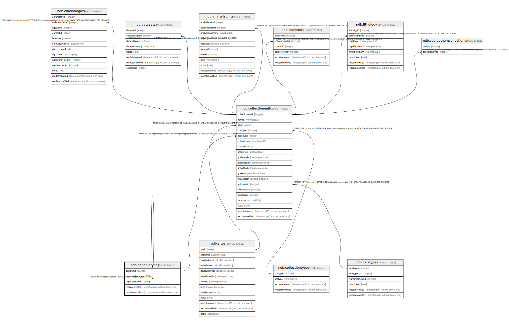

# ndb.depenvttypes

## Description

Lookup table of Depositional Environment Types. Table is referenced by the CollectionUnits table.

## Columns

| # | Name            | Type                           | Default                                             | Nullable | Children                                                                              | Parents                                 | Comment                                                                                                                                                                       |
| - | --------------- | ------------------------------ | --------------------------------------------------- | -------- | ------------------------------------------------------------------------------------- | --------------------------------------- | ----------------------------------------------------------------------------------------------------------------------------------------------------------------------------- |
| 1 | depenvt         | varchar(255)                   |                                                     | false    |                                                                                       |                                         | Depositional Environment.                                                                                                                                                     |
| 2 | depenvthigherid | integer                        |                                                     | false    |                                                                                       | [ndb.depenvttypes](ndb.depenvttypes.md) | The Depositional Environment Types are hierarchical. DepEnvtHigherID is the DepEnvtID of the higher ranked Depositional Environment. The following table gives some examples. |
| 3 | depenvtid       | integer                        | nextval('ndb.seq_depenvttypes_depenvtid'::regclass) | false    | [ndb.collectionunits](ndb.collectionunits.md) [ndb.depenvttypes](ndb.depenvttypes.md) |                                         | An arbitrary Depositional Environment Type identification number.                                                                                                             |
| 4 | recdatecreated  | timestamp(0) without time zone | timezone('UTC'::text, now())                        | false    |                                                                                       |                                         |                                                                                                                                                                               |
| 5 | recdatemodified | timestamp(0) without time zone |                                                     | false    |                                                                                       |                                         |                                                                                                                                                                               |

## Viewpoints

| Name                                      | Definition                           |
| ----------------------------------------- | ------------------------------------ |
| [Controlled Vocabularies](viewpoint-0.md) | Tables with controlled vocabularies. |
| [Hierarchical Tables](viewpoint-1.md)     | Tables with internal hierarchies.    |

## Constraints

| # | Name               | Type        | Definition                                                           |
| - | ------------------ | ----------- | -------------------------------------------------------------------- |
| 1 | depenvttypes_pkey  | PRIMARY KEY | PRIMARY KEY (depenvtid)                                              |
| 2 | fk_depenvthigherid | FOREIGN KEY | FOREIGN KEY (depenvthigherid) REFERENCES ndb.depenvttypes(depenvtid) |

## Indexes

| # | Name              | Definition                                                                        |
| - | ----------------- | --------------------------------------------------------------------------------- |
| 1 | depenvttypes_pkey | CREATE UNIQUE INDEX depenvttypes_pkey ON ndb.depenvttypes USING btree (depenvtid) |

## Triggers

| # | Name                | Definition                                                                                                                                |
| - | ------------------- | ----------------------------------------------------------------------------------------------------------------------------------------- |
| 1 | tr_sites_modifydate | CREATE TRIGGER tr_sites_modifydate BEFORE INSERT OR UPDATE ON ndb.depenvttypes FOR EACH ROW EXECUTE FUNCTION ndb.update_recdatemodified() |

## Relations

---

> Generated by [tbls](https://github.com/k1LoW/tbls)