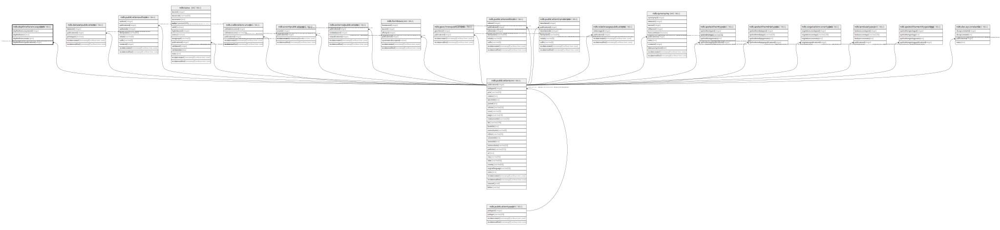

# ndb.depthreferencesystem

## Description

## Columns

| # | Name                        | Type    | Default                                                                  | Nullable | Children | Parents                                 | Comment |
| - | --------------------------- | ------- | ------------------------------------------------------------------------ | -------- | -------- | --------------------------------------- | ------- |
| 1 | depthreference              | text    |                                                                          | true     |          |                                         |         |
| 2 | depthreferencenotes         | text    |                                                                          | true     |          |                                         |         |
| 3 | depthreferencepublicationid | integer |                                                                          | true     |          | [ndb.publications](ndb.publications.md) |         |
| 4 | depthreferencesystemid      | integer | nextval('ndb.depthreferencesystem_depthreferencesystemid_seq'::regclass) | false    |          |                                         |         |

## Constraints

| # | Name                                                  | Type        | Definition                                                                           |
| - | ----------------------------------------------------- | ----------- | ------------------------------------------------------------------------------------ |
| 1 | depthreferencesystem_depthreferencepublicationid_fkey | FOREIGN KEY | FOREIGN KEY (depthreferencepublicationid) REFERENCES ndb.publications(publicationid) |
| 2 | depthreferencesystem_pkey                             | PRIMARY KEY | PRIMARY KEY (depthreferencesystemid)                                                 |

## Indexes

| # | Name                      | Definition                                                                                                     |
| - | ------------------------- | -------------------------------------------------------------------------------------------------------------- |
| 1 | depthreferencesystem_pkey | CREATE UNIQUE INDEX depthreferencesystem_pkey ON ndb.depthreferencesystem USING btree (depthreferencesystemid) |

## Relations

---

> Generated by [tbls](https://github.com/k1LoW/tbls)