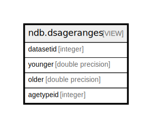

# ndb.dsageranges

## Description

<details>
<summary><strong>Table Definition</strong></summary>

```sql
CREATE VIEW dsageranges AS (
 SELECT ageranges.datasetid,
    min(ageranges.younger) AS younger,
    max(ageranges.older) AS older,
    ageranges.agetypeid
   FROM ( SELECT ds.datasetid,
                CASE
                    WHEN (ages.ageyounger IS NULL) THEN ages.age
                    ELSE ages.ageyounger
                END AS younger,
                CASE
                    WHEN (ages.ageolder IS NULL) THEN ages.age
                    ELSE ages.ageolder
                END AS older,
            chrons.agetypeid
           FROM (((ndb.samples samples
             LEFT JOIN ndb.datasets ds ON ((samples.datasetid = ds.datasetid)))
             LEFT JOIN ndb.sampleages ages ON ((ages.sampleid = samples.sampleid)))
             LEFT JOIN ndb.chronologies chrons ON ((ages.chronologyid = chrons.chronologyid)))
          WHERE (chrons.isdefault = (1)::boolean)) ageranges
  GROUP BY ageranges.datasetid, ageranges.agetypeid
)
```

</details>

## Columns

| # | Name      | Type             | Default | Nullable | Children | Parents | Comment |
| - | --------- | ---------------- | ------- | -------- | -------- | ------- | ------- |
| 1 | agetypeid | integer          |         | true     |          |         |         |
| 2 | datasetid | integer          |         | true     |          |         |         |
| 3 | older     | double precision |         | true     |          |         |         |
| 4 | younger   | double precision |         | true     |          |         |         |

## Referenced Tables

| # | # | Name                                    | Columns | Comment                                                                                                                                                                                                                                                                                                                                                                                                                                                                                                                                                                                                                                                                                                                                                                                                                                                                                                                                                                                                                                                                                                                                                                                                                                                                                                                                                                                                | Type       |
| - | - | --------------------------------------- | ------- | ------------------------------------------------------------------------------------------------------------------------------------------------------------------------------------------------------------------------------------------------------------------------------------------------------------------------------------------------------------------------------------------------------------------------------------------------------------------------------------------------------------------------------------------------------------------------------------------------------------------------------------------------------------------------------------------------------------------------------------------------------------------------------------------------------------------------------------------------------------------------------------------------------------------------------------------------------------------------------------------------------------------------------------------------------------------------------------------------------------------------------------------------------------------------------------------------------------------------------------------------------------------------------------------------------------------------------------------------------------------------------------------------------ | ---------- |
| 1 | 1 | [ndb.samples](ndb.samples.md)           | 12      | This table stores sample data. Samples belong to Analysis Units, which belong to Collection Units, which belong to Sites. Samples also belong to a Dataset, and the Dataset determines the type of sample. Thus, there could be two different samples from the same Analysis Unit, one belonging to a pollen dataset, the other to a plant macrofossil dataset.                                                                                                                                                                                                                                                                                                                                                                                                                                                                                                                                                                                                                                                                                                                                                                                                                                                                                                                                                                                                                                        | BASE TABLE |
| 2 | 2 | [ndb.datasets](ndb.datasets.md)         | 8       | This table stores the data for Datasets. A Dataset is the set of samples for a particular data type from a Collection Unit. A Collection Unit may have multiple Datasets for different data types, for example one dataset for pollen and another for plant macrofossils. Every Sample is assigned to a Dataset, and every Dataset is assigned to a Collection Unit. Samples from different Collection Units cannot be assigned to the same Dataset (although they may be assigned to Aggregate Datasets).                                                                                                                                                                                                                                                                                                                                                                                                                                                                                                                                                                                                                                                                                                                                                                                                                                                                                             | BASE TABLE |
| 3 | 3 | [ndb.sampleages](ndb.sampleages.md)     | 8       | This table stores sample ages. Ages are assigned to a Chronology. Because there may be more than one Chronology for a Collection Unit, samples may be assigned different ages for different Chronologies. A simple example is one sample age in radiocarbon years and another in calibrated radiocarbon years. The age units are an attribute of the Chronology.                                                                                                                                                                                                                                                                                                                                                                                                                                                                                                                                                                                                                                                                                                                                                                                                                                                                                                                                                                                                                                       | BASE TABLE |
| 4 | 4 | [ndb.chronologies](ndb.chronologies.md) | 13      | This table stores Chronology data. A Chronology refers to an explicit chronology assigned to a Collection Unit. A Chronology has Chronology Controls, the actual age-depth control points, which are stored in the ChronControls table. A Chronology is also based on an Age Model, which may be a numerical method that fits a curve to a set of age-depth control points or may simply be individually dated Analysis Units.<br>A Collection Unit may have more than one Chronology, for example one in radiocarbon years and another in calibrated radiocarbon years. There may be a Chronology developed by the original author and another developed by a later research project. Chronologies may be stored for archival reasons, even though they are now believed to have problems, if they were used for an important research project. One Chronology per Age Type may be designated the default Chronology, which is the Chronology currently preferred by the database stewards.<br>Based upon the Chronology, which includes the Age Model and the Chron Controls, ages are assigned to individual samples, which are stored in the SampleAges table.<br>A younger and older age bounds are assigned to the Chronology. Within these bounds the Chronology is regarded as reliable. Ages may be assigned to samples beyond the reliable age bounds, but these are not considered reliable | BASE TABLE |

## Relations



---

> Generated by [tbls](https://github.com/k1LoW/tbls)