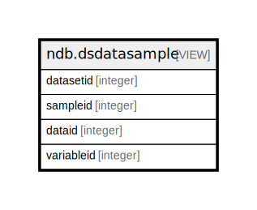

# ndb.dsdatasample

## Description

<details>
<summary><strong>Table Definition</strong></summary>

```sql
CREATE VIEW dsdatasample AS (
 SELECT ds.datasetid,
    sm.sampleid,
    dt.dataid,
    vr.variableid
   FROM (((ndb.datasets ds
     JOIN ndb.samples sm ON ((ds.datasetid = sm.datasetid)))
     JOIN ndb.data dt ON ((sm.sampleid = dt.sampleid)))
     JOIN ndb.variables vr ON ((dt.variableid = vr.variableid)))
)
```

</details>

## Columns

| # | Name       | Type    | Default | Nullable | Children | Parents | Comment |
| - | ---------- | ------- | ------- | -------- | -------- | ------- | ------- |
| 1 | datasetid  | integer |         | true     |          |         |         |
| 2 | sampleid   | integer |         | true     |          |         |         |
| 3 | dataid     | integer |         | true     |          |         |         |
| 4 | variableid | integer |         | true     |          |         |         |

## Referenced Tables

| # | # | Name                              | Columns | Comment                                                                                                                                                                                                                                                                                                                                                                                                                                                                                                    | Type       |
| - | - | --------------------------------- | ------- | ---------------------------------------------------------------------------------------------------------------------------------------------------------------------------------------------------------------------------------------------------------------------------------------------------------------------------------------------------------------------------------------------------------------------------------------------------------------------------------------------------------- | ---------- |
| 1 | 1 | [ndb.datasets](ndb.datasets.md)   | 8       | This table stores the data for Datasets. A Dataset is the set of samples for a particular data type from a Collection Unit. A Collection Unit may have multiple Datasets for different data types, for example one dataset for pollen and another for plant macrofossils. Every Sample is assigned to a Dataset, and every Dataset is assigned to a Collection Unit. Samples from different Collection Units cannot be assigned to the same Dataset (although they may be assigned to Aggregate Datasets). | BASE TABLE |
| 2 | 2 | [ndb.samples](ndb.samples.md)     | 12      | This table stores sample data. Samples belong to Analysis Units, which belong to Collection Units, which belong to Sites. Samples also belong to a Dataset, and the Dataset determines the type of sample. Thus, there could be two different samples from the same Analysis Unit, one belonging to a pollen dataset, the other to a plant macrofossil dataset.                                                                                                                                            | BASE TABLE |
| 3 | 3 | [ndb.data](ndb.data.md)           | 6       | The primary data table in the database. Each occurrence of a Variable in a sample comprises a record in the Data table.                                                                                                                                                                                                                                                                                                                                                                                    | BASE TABLE |
| 4 | 4 | [ndb.variables](ndb.variables.md) | 7       | This table lists Variables, which always consist of a Taxon and Units of measurement. Variables can also have Elements, Contexts, and Modifications. Thus, the same taxon with different measurement units (e.g. present/absent, NISP, MNI) are different Variables.                                                                                                                                                                                                                                       | BASE TABLE |

## Relations



---

> Generated by [tbls](https://github.com/k1LoW/tbls)