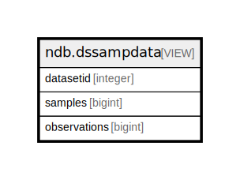

# ndb.dssampdata

## Description

<details>
<summary><strong>Table Definition</strong></summary>

```sql
CREATE VIEW dssampdata AS (
 SELECT ds.datasetid,
    count(DISTINCT smp.sampleid) AS samples,
    count(DISTINCT dt.dataid) AS observations
   FROM ((ndb.datasets ds
     LEFT JOIN ndb.samples smp ON ((smp.datasetid = ds.datasetid)))
     LEFT JOIN ndb.data dt ON ((dt.sampleid = smp.sampleid)))
  GROUP BY ds.datasetid
)
```

</details>

## Columns

| # | Name         | Type    | Default | Nullable | Children | Parents | Comment |
| - | ------------ | ------- | ------- | -------- | -------- | ------- | ------- |
| 1 | datasetid    | integer |         | true     |          |         |         |
| 2 | observations | bigint  |         | true     |          |         |         |
| 3 | samples      | bigint  |         | true     |          |         |         |

## Referenced Tables

| # | # | Name                            | Columns | Comment                                                                                                                                                                                                                                                                                                                                                                                                                                                                                                    | Type       |
| - | - | ------------------------------- | ------- | ---------------------------------------------------------------------------------------------------------------------------------------------------------------------------------------------------------------------------------------------------------------------------------------------------------------------------------------------------------------------------------------------------------------------------------------------------------------------------------------------------------- | ---------- |
| 1 | 1 | [ndb.datasets](ndb.datasets.md) | 8       | This table stores the data for Datasets. A Dataset is the set of samples for a particular data type from a Collection Unit. A Collection Unit may have multiple Datasets for different data types, for example one dataset for pollen and another for plant macrofossils. Every Sample is assigned to a Dataset, and every Dataset is assigned to a Collection Unit. Samples from different Collection Units cannot be assigned to the same Dataset (although they may be assigned to Aggregate Datasets). | BASE TABLE |
| 2 | 2 | [ndb.samples](ndb.samples.md)   | 12      | This table stores sample data. Samples belong to Analysis Units, which belong to Collection Units, which belong to Sites. Samples also belong to a Dataset, and the Dataset determines the type of sample. Thus, there could be two different samples from the same Analysis Unit, one belonging to a pollen dataset, the other to a plant macrofossil dataset.                                                                                                                                            | BASE TABLE |
| 3 | 3 | [ndb.data](ndb.data.md)         | 6       | The primary data table in the database. Each occurrence of a Variable in a sample comprises a record in the Data table.                                                                                                                                                                                                                                                                                                                                                                                    | BASE TABLE |

## Relations



---

> Generated by [tbls](https://github.com/k1LoW/tbls)