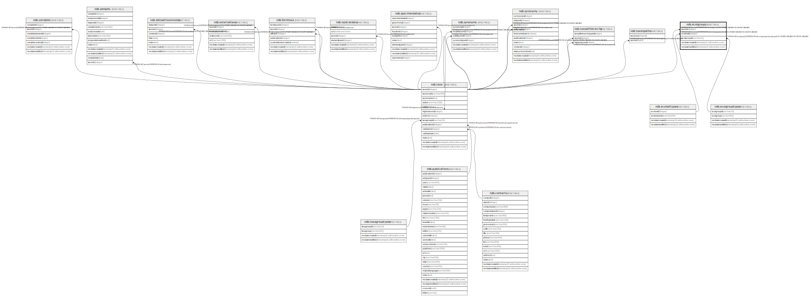

# ndb.ecolgroups

## Description

Taxa are assigned to Sets of Ecological Groups. A taxon may be assigned to more than one Set of Ecological Groups, representing different schemes for organizing taxa.

## Columns

| # | Name            | Type                           | Default                      | Nullable | Children | Parents                                     | Comment                                                                                      |
| - | --------------- | ------------------------------ | ---------------------------- | -------- | -------- | ------------------------------------------- | -------------------------------------------------------------------------------------------- |
| 1 | ecolgroupid     | varchar(4)                     |                              | false    |          | [ndb.ecolgrouptypes](ndb.ecolgrouptypes.md) | A four-letter Ecological Group identification code. Field links to the EcolGroupTypes table. |
| 2 | ecolsetid       | integer                        |                              | false    |          | [ndb.ecolsettypes](ndb.ecolsettypes.md)     | Ecological Set identification number. Field links to the EcolSetTypes table.                 |
| 3 | recdatecreated  | timestamp(0) without time zone | timezone('UTC'::text, now()) | false    |          |                                             |                                                                                              |
| 4 | recdatemodified | timestamp(0) without time zone |                              | false    |          |                                             |                                                                                              |
| 5 | taxonid         | integer                        |                              | false    |          | [ndb.taxa](ndb.taxa.md)                     | Taxon identification number. Field links to the Taxa table.                                  |

## Constraints

| # | Name                         | Type        | Definition                                                                                               |
| - | ---------------------------- | ----------- | -------------------------------------------------------------------------------------------------------- |
| 1 | ecolgroups_pkey              | PRIMARY KEY | PRIMARY KEY (taxonid, ecolsetid)                                                                         |
| 2 | ecolgroups_unique            | UNIQUE      | UNIQUE (taxonid, ecolsetid, ecolgroupid)                                                                 |
| 3 | fk_ecolgroups_ecolgrouptypes | FOREIGN KEY | FOREIGN KEY (ecolgroupid) REFERENCES ndb.ecolgrouptypes(ecolgroupid) ON UPDATE CASCADE ON DELETE CASCADE |
| 4 | fk_ecolgroups_ecolsettypes   | FOREIGN KEY | FOREIGN KEY (ecolsetid) REFERENCES ndb.ecolsettypes(ecolsetid) ON UPDATE CASCADE ON DELETE CASCADE       |
| 5 | fk_ecolgroups_taxa           | FOREIGN KEY | FOREIGN KEY (taxonid) REFERENCES ndb.taxa(taxonid) ON UPDATE CASCADE ON DELETE CASCADE                   |

## Indexes

| # | Name                      | Definition                                                                                                |
| - | ------------------------- | --------------------------------------------------------------------------------------------------------- |
| 1 | ecolgroups_pkey           | CREATE UNIQUE INDEX ecolgroups_pkey ON ndb.ecolgroups USING btree (taxonid, ecolsetid)                    |
| 2 | ecolgroups_unique         | CREATE UNIQUE INDEX ecolgroups_unique ON ndb.ecolgroups USING btree (taxonid, ecolsetid, ecolgroupid)     |
| 3 | ix_ecolgroupid_ecolgroups | CREATE INDEX ix_ecolgroupid_ecolgroups ON ndb.ecolgroups USING btree (ecolgroupid) WITH (fillfactor='10') |
| 4 | ix_ecolsetid_ecolgroups   | CREATE INDEX ix_ecolsetid_ecolgroups ON ndb.ecolgroups USING btree (ecolsetid) WITH (fillfactor='10')     |
| 5 | ix_taxonid_ecolgroups     | CREATE INDEX ix_taxonid_ecolgroups ON ndb.ecolgroups USING btree (taxonid) WITH (fillfactor='10')         |

## Triggers

| # | Name                | Definition                                                                                                                              |
| - | ------------------- | --------------------------------------------------------------------------------------------------------------------------------------- |
| 1 | tr_sites_modifydate | CREATE TRIGGER tr_sites_modifydate BEFORE INSERT OR UPDATE ON ndb.ecolgroups FOR EACH ROW EXECUTE FUNCTION ndb.update_recdatemodified() |

## Relations

---

> Generated by [tbls](https://github.com/k1LoW/tbls)