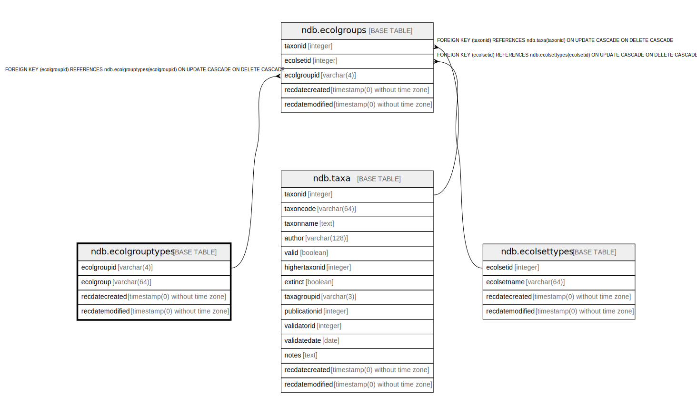

# ndb.ecolgrouptypes

## Description

Lookup table of Ecological Group Types. Table is referenced by the EcolGroups table.

## Columns

| # | Name            | Type                           | Default                      | Nullable | Children                            | Parents | Comment                                              |
| - | --------------- | ------------------------------ | ---------------------------- | -------- | ----------------------------------- | ------- | ---------------------------------------------------- |
| 1 | ecolgroup       | varchar(64)                    |                              | true     |                                     |         | Ecological Group.                                    |
| 2 | ecolgroupid     | varchar(4)                     |                              | false    | [ndb.ecolgroups](ndb.ecolgroups.md) |         | An arbitrary Ecological Group identification number. |
| 3 | recdatecreated  | timestamp(0) without time zone | timezone('UTC'::text, now()) | false    |                                     |         |                                                      |
| 4 | recdatemodified | timestamp(0) without time zone |                              | false    |                                     |         |                                                      |

## Constraints

| # | Name                | Type        | Definition                |
| - | ------------------- | ----------- | ------------------------- |
| 1 | ecolgrouptypes_pkey | PRIMARY KEY | PRIMARY KEY (ecolgroupid) |

## Indexes

| # | Name                | Definition                                                                              |
| - | ------------------- | --------------------------------------------------------------------------------------- |
| 1 | ecolgrouptypes_pkey | CREATE UNIQUE INDEX ecolgrouptypes_pkey ON ndb.ecolgrouptypes USING btree (ecolgroupid) |

## Triggers

| # | Name                | Definition                                                                                                                                  |
| - | ------------------- | ------------------------------------------------------------------------------------------------------------------------------------------- |
| 1 | tr_sites_modifydate | CREATE TRIGGER tr_sites_modifydate BEFORE INSERT OR UPDATE ON ndb.ecolgrouptypes FOR EACH ROW EXECUTE FUNCTION ndb.update_recdatemodified() |

## Relations

---

> Generated by [tbls](https://github.com/k1LoW/tbls)