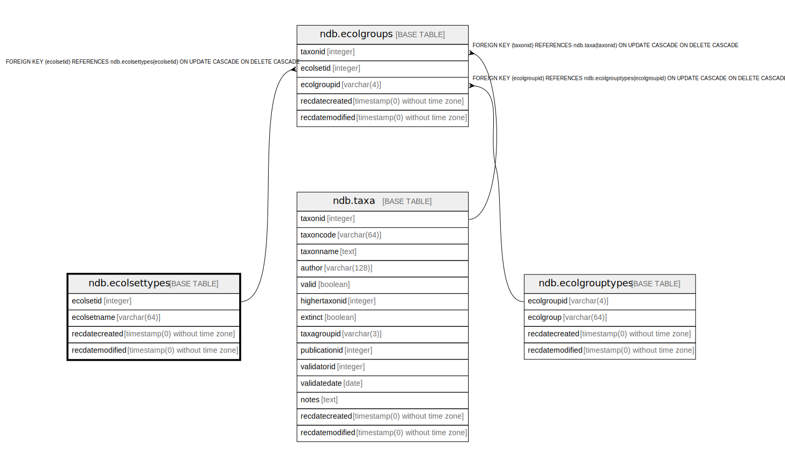

# ndb.ecolsettypes

## Description

Lookup table of Ecological Set Types. Table is referenced by the EcolGroups table.

## Columns

| # | Name            | Type                           | Default                                             | Nullable | Children                            | Parents | Comment                                            |
| - | --------------- | ------------------------------ | --------------------------------------------------- | -------- | ----------------------------------- | ------- | -------------------------------------------------- |
| 1 | ecolsetid       | integer                        | nextval('ndb.seq_ecolsettypes_ecolsetid'::regclass) | false    | [ndb.ecolgroups](ndb.ecolgroups.md) |         | An arbitrary Ecological Set identification number. |
| 2 | ecolsetname     | varchar(64)                    |                                                     | false    |                                     |         | Ecological Set name.                               |
| 3 | recdatecreated  | timestamp(0) without time zone | timezone('UTC'::text, now())                        | false    |                                     |         |                                                    |
| 4 | recdatemodified | timestamp(0) without time zone |                                                     | false    |                                     |         |                                                    |

## Constraints

| # | Name              | Type        | Definition              |
| - | ----------------- | ----------- | ----------------------- |
| 1 | ecolsettypes_pkey | PRIMARY KEY | PRIMARY KEY (ecolsetid) |

## Indexes

| # | Name              | Definition                                                                        |
| - | ----------------- | --------------------------------------------------------------------------------- |
| 1 | ecolsettypes_pkey | CREATE UNIQUE INDEX ecolsettypes_pkey ON ndb.ecolsettypes USING btree (ecolsetid) |

## Triggers

| # | Name                | Definition                                                                                                                                |
| - | ------------------- | ----------------------------------------------------------------------------------------------------------------------------------------- |
| 1 | tr_sites_modifydate | CREATE TRIGGER tr_sites_modifydate BEFORE INSERT OR UPDATE ON ndb.ecolsettypes FOR EACH ROW EXECUTE FUNCTION ndb.update_recdatemodified() |

## Relations

---

> Generated by [tbls](https://github.com/k1LoW/tbls)