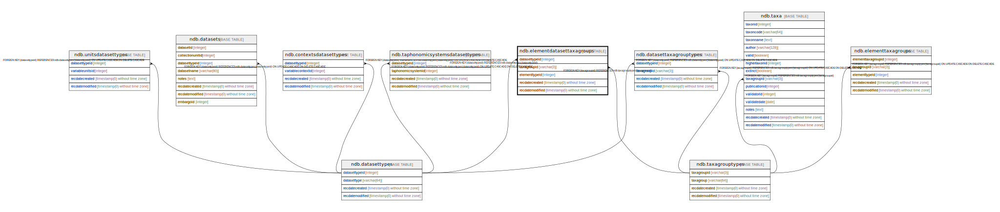

# ndb.elementdatasettaxagroups

## Description

## Columns

| # | Name            | Type                           | Default                      | Nullable | Children | Parents                                     | Comment |
| - | --------------- | ------------------------------ | ---------------------------- | -------- | -------- | ------------------------------------------- | ------- |
| 1 | datasettypeid   | integer                        |                              | false    |          | [ndb.datasettypes](ndb.datasettypes.md)     |         |
| 2 | taxagroupid     | varchar(3)                     |                              | false    |          | [ndb.taxagrouptypes](ndb.taxagrouptypes.md) |         |
| 3 | elementtypeid   | integer                        |                              | false    |          |                                             |         |
| 4 | recdatecreated  | timestamp(0) without time zone | timezone('UTC'::text, now()) | false    |          |                                             |         |
| 5 | recdatemodified | timestamp(0) without time zone |                              | false    |          |                                             |         |

## Constraints

| # | Name                          | Type        | Definition                                                             |
| - | ----------------------------- | ----------- | ---------------------------------------------------------------------- |
| 1 | fk_datasettypeid              | FOREIGN KEY | FOREIGN KEY (datasettypeid) REFERENCES ndb.datasettypes(datasettypeid) |
| 2 | elementdatasettaxagroups_pkey | PRIMARY KEY | PRIMARY KEY (datasettypeid, taxagroupid, elementtypeid)                |
| 3 | edt_group                     | FOREIGN KEY | FOREIGN KEY (taxagroupid) REFERENCES ndb.taxagrouptypes(taxagroupid)   |

## Indexes

| # | Name                          | Definition                                                                                                                                |
| - | ----------------------------- | ----------------------------------------------------------------------------------------------------------------------------------------- |
| 1 | elementdatasettaxagroups_pkey | CREATE UNIQUE INDEX elementdatasettaxagroups_pkey ON ndb.elementdatasettaxagroups USING btree (datasettypeid, taxagroupid, elementtypeid) |

## Triggers

| # | Name                | Definition                                                                                                                                            |
| - | ------------------- | ----------------------------------------------------------------------------------------------------------------------------------------------------- |
| 1 | tr_sites_modifydate | CREATE TRIGGER tr_sites_modifydate BEFORE INSERT OR UPDATE ON ndb.elementdatasettaxagroups FOR EACH ROW EXECUTE FUNCTION ndb.update_recdatemodified() |

## Relations

---

> Generated by [tbls](https://github.com/k1LoW/tbls)