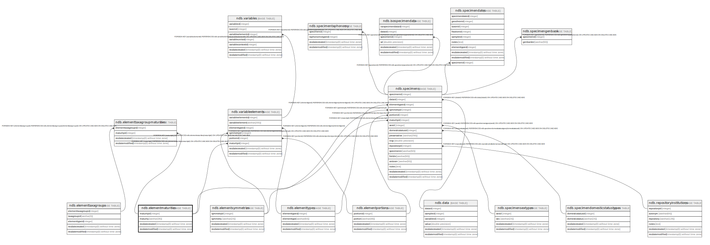

# ndb.elementmaturities

## Description

## Columns

| # | Name            | Type                           | Default                                                   | Nullable | Children                                                                                                                                              | Parents | Comment |
| - | --------------- | ------------------------------ | --------------------------------------------------------- | -------- | ----------------------------------------------------------------------------------------------------------------------------------------------------- | ------- | ------- |
| 1 | maturityid      | integer                        | nextval('ndb.seq_elementmaturities_maturityid'::regclass) | false    | [ndb.elementtaxagroupmaturities](ndb.elementtaxagroupmaturities.md) [ndb.specimens](ndb.specimens.md) [ndb.variableelements](ndb.variableelements.md) |         |         |
| 2 | maturity        | varchar(36)                    |                                                           | false    |                                                                                                                                                       |         |         |
| 3 | recdatecreated  | timestamp(0) without time zone | timezone('UTC'::text, now())                              | false    |                                                                                                                                                       |         |         |
| 4 | recdatemodified | timestamp(0) without time zone |                                                           | false    |                                                                                                                                                       |         |         |

## Viewpoints

| Name                                      | Definition                           |
| ----------------------------------------- | ------------------------------------ |
| [Controlled Vocabularies](viewpoint-0.md) | Tables with controlled vocabularies. |

## Constraints

| # | Name                   | Type        | Definition               |
| - | ---------------------- | ----------- | ------------------------ |
| 1 | elementmaturities_pkey | PRIMARY KEY | PRIMARY KEY (maturityid) |

## Indexes

| # | Name                   | Definition                                                                                                      |
| - | ---------------------- | --------------------------------------------------------------------------------------------------------------- |
| 1 | elementmaturities_pkey | CREATE UNIQUE INDEX elementmaturities_pkey ON ndb.elementmaturities USING btree (maturityid)                    |
| 2 | ix_elementmaturities   | CREATE UNIQUE INDEX ix_elementmaturities ON ndb.elementmaturities USING btree (maturity) WITH (fillfactor='10') |

## Triggers

| # | Name                | Definition                                                                                                                                     |
| - | ------------------- | ---------------------------------------------------------------------------------------------------------------------------------------------- |
| 1 | tr_sites_modifydate | CREATE TRIGGER tr_sites_modifydate BEFORE INSERT OR UPDATE ON ndb.elementmaturities FOR EACH ROW EXECUTE FUNCTION ndb.update_recdatemodified() |

## Relations

---

> Generated by [tbls](https://github.com/k1LoW/tbls)