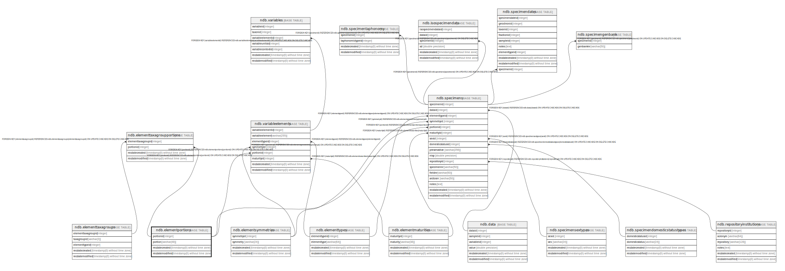

# ndb.elementportions

## Description

## Columns

| # | Name            | Type                           | Default                                                | Nullable | Children                                                                                                                                          | Parents | Comment |
| - | --------------- | ------------------------------ | ------------------------------------------------------ | -------- | ------------------------------------------------------------------------------------------------------------------------------------------------- | ------- | ------- |
| 1 | portion         | varchar(48)                    |                                                        | true     |                                                                                                                                                   |         |         |
| 2 | portionid       | integer                        | nextval('ndb.seq_elementportions_portionid'::regclass) | false    | [ndb.elementtaxagroupportions](ndb.elementtaxagroupportions.md) [ndb.specimens](ndb.specimens.md) [ndb.variableelements](ndb.variableelements.md) |         |         |
| 3 | recdatecreated  | timestamp(0) without time zone | timezone('UTC'::text, now())                           | false    |                                                                                                                                                   |         |         |
| 4 | recdatemodified | timestamp(0) without time zone |                                                        | false    |                                                                                                                                                   |         |         |

## Constraints

| # | Name                 | Type        | Definition              |
| - | -------------------- | ----------- | ----------------------- |
| 1 | elementportions_pkey | PRIMARY KEY | PRIMARY KEY (portionid) |

## Indexes

| # | Name                 | Definition                                                                                                 |
| - | -------------------- | ---------------------------------------------------------------------------------------------------------- |
| 1 | elementportions_pkey | CREATE UNIQUE INDEX elementportions_pkey ON ndb.elementportions USING btree (portionid)                    |
| 2 | ix_elementportions   | CREATE UNIQUE INDEX ix_elementportions ON ndb.elementportions USING btree (portion) WITH (fillfactor='10') |

## Triggers

| # | Name                | Definition                                                                                                                                   |
| - | ------------------- | -------------------------------------------------------------------------------------------------------------------------------------------- |
| 1 | tr_sites_modifydate | CREATE TRIGGER tr_sites_modifydate BEFORE INSERT OR UPDATE ON ndb.elementportions FOR EACH ROW EXECUTE FUNCTION ndb.update_recdatemodified() |

## Relations

---

> Generated by [tbls](https://github.com/k1LoW/tbls)