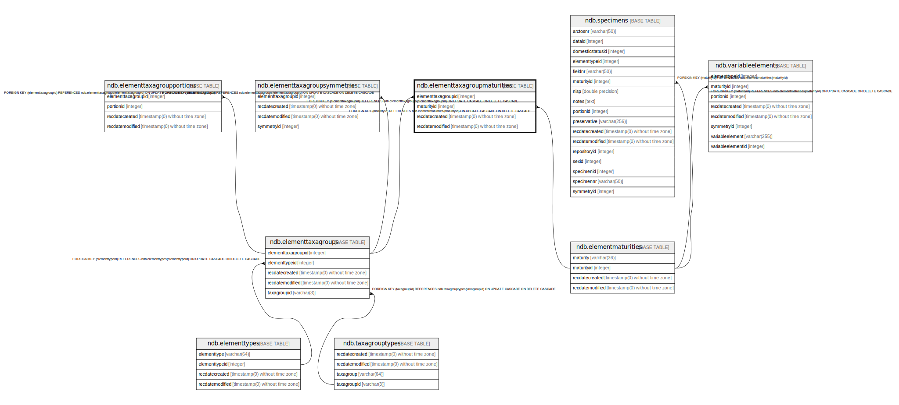

# ndb.elementtaxagroupmaturities

## Description

## Columns

| # | Name               | Type                           | Default                      | Nullable | Children | Parents                                           | Comment |
| - | ------------------ | ------------------------------ | ---------------------------- | -------- | -------- | ------------------------------------------------- | ------- |
| 1 | elementtaxagroupid | integer                        |                              | false    |          | [ndb.elementtaxagroups](ndb.elementtaxagroups.md) |         |
| 2 | maturityid         | integer                        |                              | false    |          | [ndb.elementmaturities](ndb.elementmaturities.md) |         |
| 3 | recdatecreated     | timestamp(0) without time zone | timezone('UTC'::text, now()) | false    |          |                                                   |         |
| 4 | recdatemodified    | timestamp(0) without time zone |                              | false    |          |                                                   |         |

## Constraints

| # | Name                                            | Type        | Definition                                                                                                                |
| - | ----------------------------------------------- | ----------- | ------------------------------------------------------------------------------------------------------------------------- |
| 1 | elementtaxagroupmaturities_pkey                 | PRIMARY KEY | PRIMARY KEY (elementtaxagroupid, maturityid)                                                                              |
| 2 | fk_elementtaxagroupmaturities_elementmaturities | FOREIGN KEY | FOREIGN KEY (maturityid) REFERENCES ndb.elementmaturities(maturityid) ON UPDATE CASCADE ON DELETE CASCADE                 |
| 3 | fk_elementtaxagroupmaturities_elementtaxagroup  | FOREIGN KEY | FOREIGN KEY (elementtaxagroupid) REFERENCES ndb.elementtaxagroups(elementtaxagroupid) ON UPDATE CASCADE ON DELETE CASCADE |

## Indexes

| # | Name                            | Definition                                                                                                                         |
| - | ------------------------------- | ---------------------------------------------------------------------------------------------------------------------------------- |
| 1 | elementtaxagroupmaturities_pkey | CREATE UNIQUE INDEX elementtaxagroupmaturities_pkey ON ndb.elementtaxagroupmaturities USING btree (elementtaxagroupid, maturityid) |

## Triggers

| # | Name                | Definition                                                                                                                                              |
| - | ------------------- | ------------------------------------------------------------------------------------------------------------------------------------------------------- |
| 1 | tr_sites_modifydate | CREATE TRIGGER tr_sites_modifydate BEFORE INSERT OR UPDATE ON ndb.elementtaxagroupmaturities FOR EACH ROW EXECUTE FUNCTION ndb.update_recdatemodified() |

## Relations

---

> Generated by [tbls](https://github.com/k1LoW/tbls)