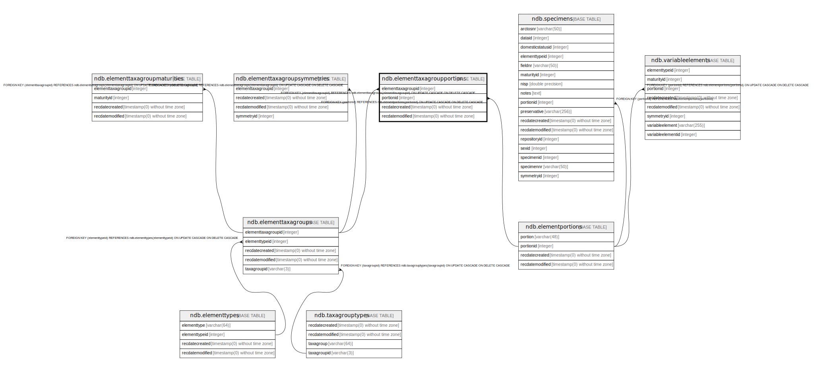

# ndb.elementtaxagroupportions

## Description

## Columns

| # | Name               | Type                           | Default                      | Nullable | Children | Parents                                           | Comment |
| - | ------------------ | ------------------------------ | ---------------------------- | -------- | -------- | ------------------------------------------------- | ------- |
| 1 | elementtaxagroupid | integer                        |                              | false    |          | [ndb.elementtaxagroups](ndb.elementtaxagroups.md) |         |
| 2 | portionid          | integer                        |                              | false    |          | [ndb.elementportions](ndb.elementportions.md)     |         |
| 3 | recdatecreated     | timestamp(0) without time zone | timezone('UTC'::text, now()) | false    |          |                                                   |         |
| 4 | recdatemodified    | timestamp(0) without time zone |                              | false    |          |                                                   |         |

## Constraints

| # | Name                                          | Type        | Definition                                                                                                                |
| - | --------------------------------------------- | ----------- | ------------------------------------------------------------------------------------------------------------------------- |
| 1 | fk_elementtaxagroupportions_elementportions   | FOREIGN KEY | FOREIGN KEY (portionid) REFERENCES ndb.elementportions(portionid) ON UPDATE CASCADE ON DELETE CASCADE                     |
| 2 | elementtaxagroupportions_pkey                 | PRIMARY KEY | PRIMARY KEY (elementtaxagroupid, portionid)                                                                               |
| 3 | fk_elementtaxagroupportions_elementtaxagroups | FOREIGN KEY | FOREIGN KEY (elementtaxagroupid) REFERENCES ndb.elementtaxagroups(elementtaxagroupid) ON UPDATE CASCADE ON DELETE CASCADE |

## Indexes

| # | Name                          | Definition                                                                                                                    |
| - | ----------------------------- | ----------------------------------------------------------------------------------------------------------------------------- |
| 1 | elementtaxagroupportions_pkey | CREATE UNIQUE INDEX elementtaxagroupportions_pkey ON ndb.elementtaxagroupportions USING btree (elementtaxagroupid, portionid) |

## Triggers

| # | Name                | Definition                                                                                                                                            |
| - | ------------------- | ----------------------------------------------------------------------------------------------------------------------------------------------------- |
| 1 | tr_sites_modifydate | CREATE TRIGGER tr_sites_modifydate BEFORE INSERT OR UPDATE ON ndb.elementtaxagroupportions FOR EACH ROW EXECUTE FUNCTION ndb.update_recdatemodified() |

## Relations

---

> Generated by [tbls](https://github.com/k1LoW/tbls)