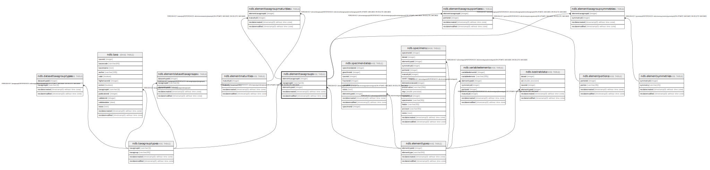

# ndb.elementtaxagroups

## Description

## Columns

| # | Name               | Type                           | Default                                                           | Nullable | Children                                                                                                                                                                                                | Parents                                     | Comment |
| - | ------------------ | ------------------------------ | ----------------------------------------------------------------- | -------- | ------------------------------------------------------------------------------------------------------------------------------------------------------------------------------------------------------- | ------------------------------------------- | ------- |
| 1 | elementtaxagroupid | integer                        | nextval('ndb.seq_elementtaxagroups_elementtaxagroupid'::regclass) | false    | [ndb.elementtaxagroupmaturities](ndb.elementtaxagroupmaturities.md) [ndb.elementtaxagroupportions](ndb.elementtaxagroupportions.md) [ndb.elementtaxagroupsymmetries](ndb.elementtaxagroupsymmetries.md) |                                             |         |
| 2 | elementtypeid      | integer                        |                                                                   | false    |                                                                                                                                                                                                         | [ndb.elementtypes](ndb.elementtypes.md)     |         |
| 3 | recdatecreated     | timestamp(0) without time zone | timezone('UTC'::text, now())                                      | false    |                                                                                                                                                                                                         |                                             |         |
| 4 | recdatemodified    | timestamp(0) without time zone |                                                                   | false    |                                                                                                                                                                                                         |                                             |         |
| 5 | taxagroupid        | varchar(3)                     |                                                                   | false    |                                                                                                                                                                                                         | [ndb.taxagrouptypes](ndb.taxagrouptypes.md) |         |

## Viewpoints

| Name                                      | Definition                           |
| ----------------------------------------- | ------------------------------------ |
| [Controlled Vocabularies](viewpoint-0.md) | Tables with controlled vocabularies. |

## Constraints

| # | Name                                    | Type        | Definition                                                                                                 |
| - | --------------------------------------- | ----------- | ---------------------------------------------------------------------------------------------------------- |
| 1 | elementtaxagroups_pkey                  | PRIMARY KEY | PRIMARY KEY (elementtaxagroupid)                                                                           |
| 2 | fk_elementtaxagrouptypes_elementtypes   | FOREIGN KEY | FOREIGN KEY (elementtypeid) REFERENCES ndb.elementtypes(elementtypeid) ON UPDATE CASCADE ON DELETE CASCADE |
| 3 | fk_elementtaxagrouptypes_taxagrouptypes | FOREIGN KEY | FOREIGN KEY (taxagroupid) REFERENCES ndb.taxagrouptypes(taxagroupid) ON UPDATE CASCADE ON DELETE CASCADE   |

## Indexes

| # | Name                     | Definition                                                                                                                            |
| - | ------------------------ | ------------------------------------------------------------------------------------------------------------------------------------- |
| 1 | elementtaxagroups_pkey   | CREATE UNIQUE INDEX elementtaxagroups_pkey ON ndb.elementtaxagroups USING btree (elementtaxagroupid)                                  |
| 2 | ix_elementtaxagrouptypes | CREATE UNIQUE INDEX ix_elementtaxagrouptypes ON ndb.elementtaxagroups USING btree (taxagroupid, elementtypeid) WITH (fillfactor='10') |

## Triggers

| # | Name                | Definition                                                                                                                                     |
| - | ------------------- | ---------------------------------------------------------------------------------------------------------------------------------------------- |
| 1 | tr_sites_modifydate | CREATE TRIGGER tr_sites_modifydate BEFORE INSERT OR UPDATE ON ndb.elementtaxagroups FOR EACH ROW EXECUTE FUNCTION ndb.update_recdatemodified() |

## Relations

---

> Generated by [tbls](https://github.com/k1LoW/tbls)