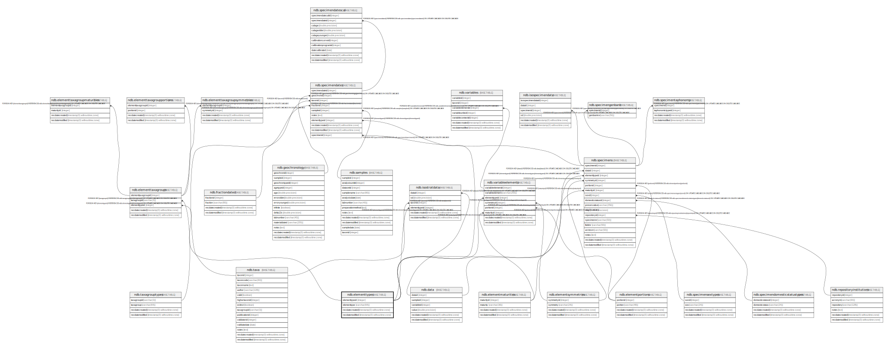

# ndb.elementtypes

## Description

## Columns

| # | Name            | Type                           | Default                                                 | Nullable | Children                                                                                                                                                                                                              | Parents | Comment |
| - | --------------- | ------------------------------ | ------------------------------------------------------- | -------- | --------------------------------------------------------------------------------------------------------------------------------------------------------------------------------------------------------------------- | ------- | ------- |
| 1 | elementtype     | varchar(64)                    |                                                         | false    |                                                                                                                                                                                                                       |         |         |
| 2 | elementtypeid   | integer                        | nextval('ndb.seq_elementtypes_elementtypeid'::regclass) | false    | [ndb.elementtaxagroups](ndb.elementtaxagroups.md) [ndb.isostratdata](ndb.isostratdata.md) [ndb.specimendates](ndb.specimendates.md) [ndb.specimens](ndb.specimens.md) [ndb.variableelements](ndb.variableelements.md) |         |         |
| 3 | recdatecreated  | timestamp(0) without time zone | timezone('UTC'::text, now())                            | false    |                                                                                                                                                                                                                       |         |         |
| 4 | recdatemodified | timestamp(0) without time zone |                                                         | false    |                                                                                                                                                                                                                       |         |         |

## Viewpoints

| Name                                      | Definition                           |
| ----------------------------------------- | ------------------------------------ |
| [Controlled Vocabularies](viewpoint-0.md) | Tables with controlled vocabularies. |

## Constraints

| # | Name              | Type        | Definition                  |
| - | ----------------- | ----------- | --------------------------- |
| 1 | elementtypes_pkey | PRIMARY KEY | PRIMARY KEY (elementtypeid) |

## Indexes

| # | Name              | Definition                                                                                               |
| - | ----------------- | -------------------------------------------------------------------------------------------------------- |
| 1 | elementtypes_pkey | CREATE UNIQUE INDEX elementtypes_pkey ON ndb.elementtypes USING btree (elementtypeid)                    |
| 2 | ix_elementtypes   | CREATE UNIQUE INDEX ix_elementtypes ON ndb.elementtypes USING btree (elementtype) WITH (fillfactor='10') |

## Triggers

| # | Name                | Definition                                                                                                                                |
| - | ------------------- | ----------------------------------------------------------------------------------------------------------------------------------------- |
| 1 | tr_sites_modifydate | CREATE TRIGGER tr_sites_modifydate BEFORE INSERT OR UPDATE ON ndb.elementtypes FOR EACH ROW EXECUTE FUNCTION ndb.update_recdatemodified() |

## Relations

---

> Generated by [tbls](https://github.com/k1LoW/tbls)