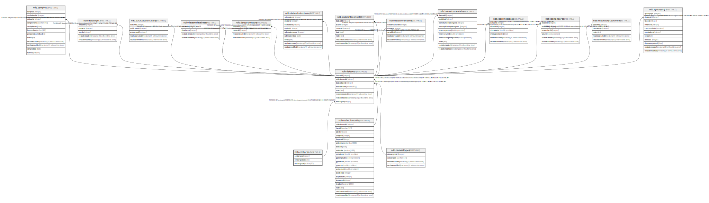

# ndb.embargo

## Description

## Columns

| # | Name        | Type        | Default                                        | Nullable | Children                        | Parents | Comment |
| - | ----------- | ----------- | ---------------------------------------------- | -------- | ------------------------------- | ------- | ------- |
| 1 | embargodate | date        |                                                | false    |                                 |         |         |
| 2 | embargoid   | integer     | nextval('ndb.seq_embargo_embargoid'::regclass) | false    | [ndb.datasets](ndb.datasets.md) |         |         |
| 3 | embargopw   | varchar(20) |                                                | true     |                                 |         |         |

## Constraints

| # | Name         | Type        | Definition              |
| - | ------------ | ----------- | ----------------------- |
| 1 | embargo_pkey | PRIMARY KEY | PRIMARY KEY (embargoid) |

## Indexes

| # | Name         | Definition                                                              |
| - | ------------ | ----------------------------------------------------------------------- |
| 1 | embargo_pkey | CREATE UNIQUE INDEX embargo_pkey ON ndb.embargo USING btree (embargoid) |

## Relations

---

> Generated by [tbls](https://github.com/k1LoW/tbls)