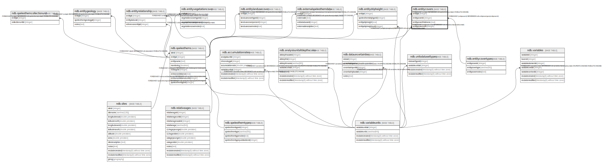

# ndb.entitycovers

## Description

## Columns

| # | Name                 | Type    | Default | Nullable | Children | Parents                                         | Comment |
| - | -------------------- | ------- | ------- | -------- | -------- | ----------------------------------------------- | ------- |
| 1 | entityid             | integer |         | true     |          | [ndb.speleothems](ndb.speleothems.md)           |         |
| 2 | entitycoverid        | integer |         | true     |          | [ndb.entitycovertypes](ndb.entitycovertypes.md) |         |
| 3 | entitycoverthickness | real    |         | true     |          |                                                 |         |
| 4 | entitycoverunits     | integer |         | true     |          | [ndb.variableunits](ndb.variableunits.md)       |         |

## Constraints

| # | Name                               | Type        | Definition                                                                    |
| - | ---------------------------------- | ----------- | ----------------------------------------------------------------------------- |
| 1 | entitycovers_entitycoverunits_fkey | FOREIGN KEY | FOREIGN KEY (entitycoverunits) REFERENCES ndb.variableunits(variableunitsid)  |
| 2 | entitycovers_entitycoverid_fkey    | FOREIGN KEY | FOREIGN KEY (entitycoverid) REFERENCES ndb.entitycovertypes(entitycoverid)    |
| 3 | entitycovers_entityid_fkey         | FOREIGN KEY | FOREIGN KEY (entityid) REFERENCES ndb.speleothems(entityid) ON DELETE CASCADE |

## Relations

---

> Generated by [tbls](https://github.com/k1LoW/tbls)