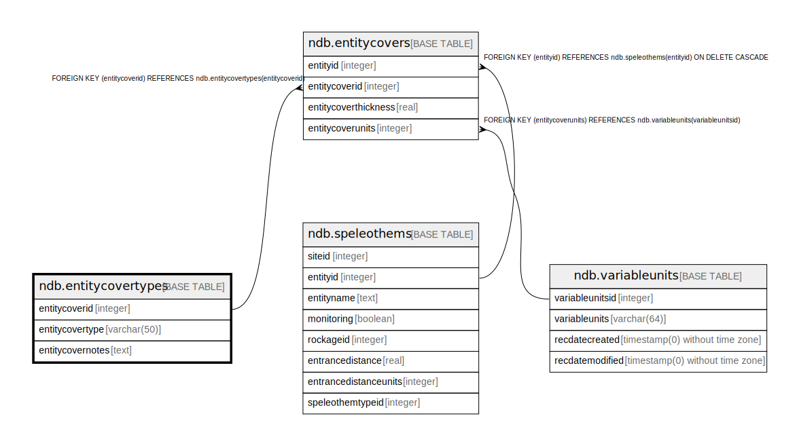

# ndb.entitycovertypes

## Description

## Columns

| # | Name             | Type        | Default                                                     | Nullable | Children                                | Parents | Comment |
| - | ---------------- | ----------- | ----------------------------------------------------------- | -------- | --------------------------------------- | ------- | ------- |
| 1 | entitycoverid    | integer     | nextval('ndb.entitycovertypes_entitycoverid_seq'::regclass) | false    | [ndb.entitycovers](ndb.entitycovers.md) |         |         |
| 2 | entitycovertype  | varchar(50) |                                                             | true     |                                         |         |         |
| 3 | entitycovernotes | text        |                                                             | true     |                                         |         |         |

## Constraints

| # | Name                  | Type        | Definition                  |
| - | --------------------- | ----------- | --------------------------- |
| 1 | entitycovertypes_pkey | PRIMARY KEY | PRIMARY KEY (entitycoverid) |

## Indexes

| # | Name                  | Definition                                                                                    |
| - | --------------------- | --------------------------------------------------------------------------------------------- |
| 1 | entitycovertypes_pkey | CREATE UNIQUE INDEX entitycovertypes_pkey ON ndb.entitycovertypes USING btree (entitycoverid) |

## Relations

---

> Generated by [tbls](https://github.com/k1LoW/tbls)