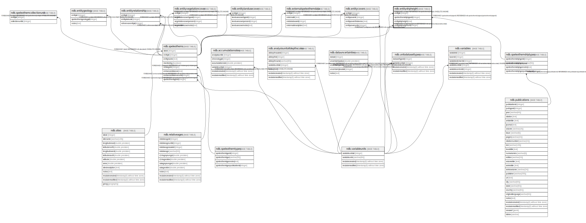

# ndb.entitydripheight

## Description

## Columns

| # | Name                 | Type    | Default | Nullable | Children | Parents                                               | Comment |
| - | -------------------- | ------- | ------- | -------- | -------- | ----------------------------------------------------- | ------- |
| 1 | entitydripheight     | real    |         | true     |          |                                                       |         |
| 2 | entitydripheightunit | integer |         | true     |          | [ndb.variableunits](ndb.variableunits.md)             |         |
| 3 | entityid             | integer |         | true     |          | [ndb.speleothems](ndb.speleothems.md)                 |         |
| 4 | speleothemdriptypeid | integer |         | true     |          | [ndb.speleothemdriptypes](ndb.speleothemdriptypes.md) |         |

## Constraints

| # | Name                                       | Type        | Definition                                                                                  |
| - | ------------------------------------------ | ----------- | ------------------------------------------------------------------------------------------- |
| 1 | entitydripheight_entitydripheightunit_fkey | FOREIGN KEY | FOREIGN KEY (entitydripheightunit) REFERENCES ndb.variableunits(variableunitsid)            |
| 2 | entitydripheight_entityid_fkey             | FOREIGN KEY | FOREIGN KEY (entityid) REFERENCES ndb.speleothems(entityid) ON DELETE CASCADE               |
| 3 | entitydripheight_speleothemdriptypeid_fkey | FOREIGN KEY | FOREIGN KEY (speleothemdriptypeid) REFERENCES ndb.speleothemdriptypes(speleothemdriptypeid) |

## Relations

---

> Generated by [tbls](https://github.com/k1LoW/tbls)