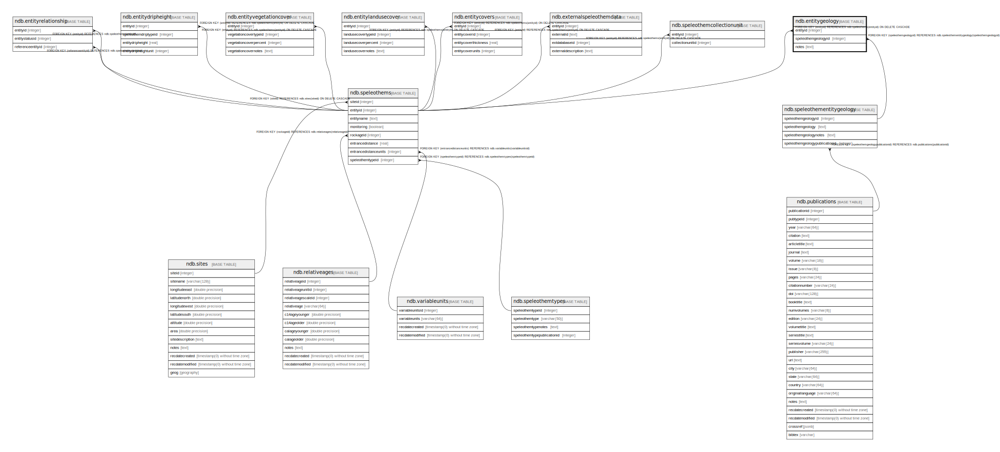

# ndb.entitygeology

## Description

## Columns

| # | Name                | Type    | Default | Nullable | Children | Parents                                                       | Comment |
| - | ------------------- | ------- | ------- | -------- | -------- | ------------------------------------------------------------- | ------- |
| 1 | entityid            | integer |         | true     |          | [ndb.speleothems](ndb.speleothems.md)                         |         |
| 2 | speleothemgeologyid | integer |         | true     |          | [ndb.speleothementitygeology](ndb.speleothementitygeology.md) |         |
| 3 | notes               | text    |         | true     |          |                                                               |         |

## Constraints

| # | Name                                   | Type        | Definition                                                                                    |
| - | -------------------------------------- | ----------- | --------------------------------------------------------------------------------------------- |
| 1 | entitygeology_speleothemgeologyid_fkey | FOREIGN KEY | FOREIGN KEY (speleothemgeologyid) REFERENCES ndb.speleothementitygeology(speleothemgeologyid) |
| 2 | entitygeology_entityid_fkey            | FOREIGN KEY | FOREIGN KEY (entityid) REFERENCES ndb.speleothems(entityid) ON DELETE CASCADE                 |

## Relations

---

> Generated by [tbls](https://github.com/k1LoW/tbls)