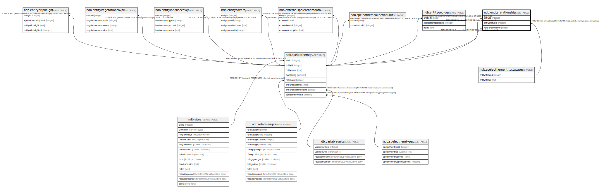

# ndb.entityrelationship

## Description

## Columns

| # | Name              | Type    | Default | Nullable | Children | Parents                                                         | Comment |
| - | ----------------- | ------- | ------- | -------- | -------- | --------------------------------------------------------------- | ------- |
| 1 | entityid          | integer |         | true     |          | [ndb.speleothems](ndb.speleothems.md)                           |         |
| 2 | entitystatusid    | integer |         | true     |          | [ndb.speleothementitystatuses](ndb.speleothementitystatuses.md) |         |
| 3 | referenceentityid | integer |         | true     |          | [ndb.speleothems](ndb.speleothems.md)                           |         |

## Constraints

| # | Name                                      | Type        | Definition                                                                           |
| - | ----------------------------------------- | ----------- | ------------------------------------------------------------------------------------ |
| 1 | entityrelationship_entitystatusid_fkey    | FOREIGN KEY | FOREIGN KEY (entitystatusid) REFERENCES ndb.speleothementitystatuses(entitystatusid) |
| 2 | entityrelationship_entityid_fkey          | FOREIGN KEY | FOREIGN KEY (entityid) REFERENCES ndb.speleothems(entityid)                          |
| 3 | entityrelationship_referenceentityid_fkey | FOREIGN KEY | FOREIGN KEY (referenceentityid) REFERENCES ndb.speleothems(entityid)                 |

## Relations

---

> Generated by [tbls](https://github.com/k1LoW/tbls)