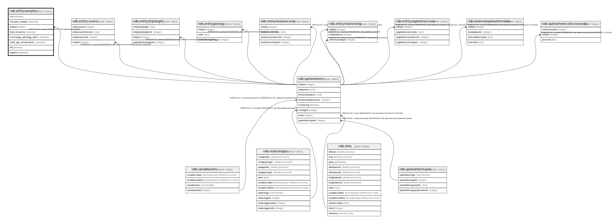

# ndb.entitysamples

## Description

## Columns

| # | Name                        | Type    | Default | Nullable | Children | Parents                               | Comment |
| - | --------------------------- | ------- | ------- | -------- | -------- | ------------------------------------- | ------- |
| 1 | c14                         | boolean |         | true     |          |                                       |         |
| 2 | clumped_isotopes            | boolean |         | true     |          |                                       |         |
| 3 | entityid                    | integer |         | false    |          | [ndb.speleothems](ndb.speleothems.md) |         |
| 4 | fluid_inclusions            | boolean |         | true     |          |                                       |         |
| 5 | mineralogy_petrology_fabric | boolean |         | true     |          |                                       |         |
| 6 | noble_gas_temperatures      | boolean |         | true     |          |                                       |         |
| 7 | odl                         | boolean |         | true     |          |                                       |         |
| 8 | organics                    | boolean |         | true     |          |                                       |         |

## Constraints

| # | Name                        | Type        | Definition                                                  |
| - | --------------------------- | ----------- | ----------------------------------------------------------- |
| 1 | entitysamples_entityid_fkey | FOREIGN KEY | FOREIGN KEY (entityid) REFERENCES ndb.speleothems(entityid) |
| 2 | entitysamples_pkey          | PRIMARY KEY | PRIMARY KEY (entityid)                                      |

## Indexes

| # | Name               | Definition                                                                         |
| - | ------------------ | ---------------------------------------------------------------------------------- |
| 1 | entitysamples_pkey | CREATE UNIQUE INDEX entitysamples_pkey ON ndb.entitysamples USING btree (entityid) |

## Relations

---

> Generated by [tbls](https://github.com/k1LoW/tbls)