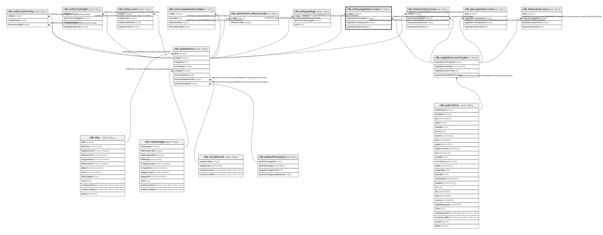

# ndb.entityvegetationcover

## Description

## Columns

| # | Name                   | Type    | Default | Nullable | Children | Parents                                                 | Comment |
| - | ---------------------- | ------- | ------- | -------- | -------- | ------------------------------------------------------- | ------- |
| 1 | entityid               | integer |         | true     |          | [ndb.speleothems](ndb.speleothems.md)                   |         |
| 2 | vegetationcovernotes   | text    |         | true     |          |                                                         |         |
| 3 | vegetationcoverpercent | integer |         | true     |          |                                                         |         |
| 4 | vegetationcovertypeid  | integer |         | true     |          | [ndb.vegetationcovertypes](ndb.vegetationcovertypes.md) |         |

## Constraints

| # | Name                                             | Type        | Definition                                                                                                       |
| - | ------------------------------------------------ | ----------- | ---------------------------------------------------------------------------------------------------------------- |
| 1 | entityvegetationcover_entityid_fkey              | FOREIGN KEY | FOREIGN KEY (entityid) REFERENCES ndb.speleothems(entityid) ON DELETE CASCADE                                    |
| 2 | entityvegetationcover_vegetationcovertypeid_fkey | FOREIGN KEY | FOREIGN KEY (vegetationcovertypeid) REFERENCES ndb.vegetationcovertypes(vegetationcovertypeid) ON DELETE CASCADE |

## Relations

---

> Generated by [tbls](https://github.com/k1LoW/tbls)