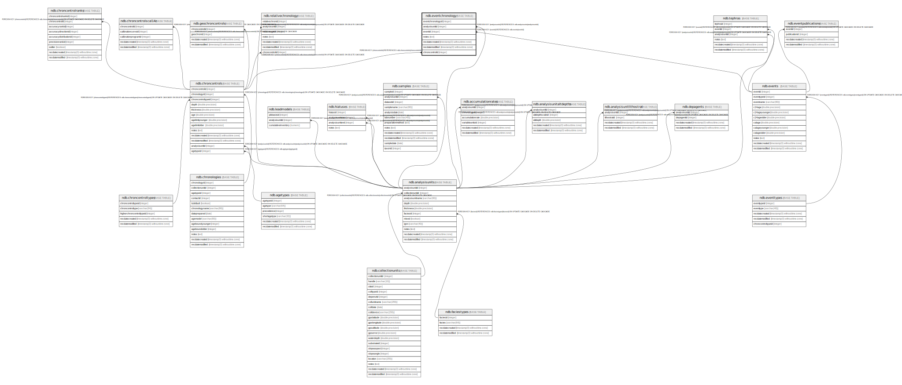

# ndb.eventchronology

## Description

## Columns

| # | Name              | Type                           | Default                                                        | Nullable | Children | Parents                                   | Comment |
| - | ----------------- | ------------------------------ | -------------------------------------------------------------- | -------- | -------- | ----------------------------------------- | ------- |
| 1 | eventchronologyid | integer                        | nextval('ndb.seq_eventchronology_eventchronologyid'::regclass) | false    |          |                                           |         |
| 2 | analysisunitid    | integer                        |                                                                | true     |          | [ndb.analysisunits](ndb.analysisunits.md) |         |
| 3 | eventid           | integer                        |                                                                | false    |          | [ndb.events](ndb.events.md)               |         |
| 4 | notes             | text                           |                                                                | true     |          |                                           |         |
| 5 | recdatecreated    | timestamp(0) without time zone | timezone('UTC'::text, now())                                   | false    |          |                                           |         |
| 6 | recdatemodified   | timestamp(0) without time zone |                                                                | false    |          |                                           |         |
| 7 | chroncontrolid    | integer                        |                                                                | false    |          | [ndb.chroncontrols](ndb.chroncontrols.md) |         |

## Constraints

| # | Name                 | Type        | Definition                                                                |
| - | -------------------- | ----------- | ------------------------------------------------------------------------- |
| 1 | evc_alu              | FOREIGN KEY | FOREIGN KEY (analysisunitid) REFERENCES ndb.analysisunits(analysisunitid) |
| 2 | evc_ccid             | FOREIGN KEY | FOREIGN KEY (chroncontrolid) REFERENCES ndb.chroncontrols(chroncontrolid) |
| 3 | eventchronology_pkey | PRIMARY KEY | PRIMARY KEY (eventchronologyid)                                           |
| 4 | evc_evt              | FOREIGN KEY | FOREIGN KEY (eventid) REFERENCES ndb.events(eventid)                      |
| 5 | uniqueeventset       | UNIQUE      | UNIQUE (analysisunitid, eventid, chroncontrolid)                          |

## Indexes

| # | Name                              | Definition                                                                                                                |
| - | --------------------------------- | ------------------------------------------------------------------------------------------------------------------------- |
| 1 | eventchronology_pkey              | CREATE UNIQUE INDEX eventchronology_pkey ON ndb.eventchronology USING btree (eventchronologyid)                           |
| 2 | uniqueeventset                    | CREATE UNIQUE INDEX uniqueeventset ON ndb.eventchronology USING btree (analysisunitid, eventid, chroncontrolid)           |
| 3 | ix_analysisunitid_eventchronology | CREATE INDEX ix_analysisunitid_eventchronology ON ndb.eventchronology USING btree (analysisunitid) WITH (fillfactor='10') |
| 4 | ix_eventid_eventchronology        | CREATE INDEX ix_eventid_eventchronology ON ndb.eventchronology USING btree (eventid) WITH (fillfactor='10')               |

## Triggers

| # | Name                | Definition                                                                                                                                   |
| - | ------------------- | -------------------------------------------------------------------------------------------------------------------------------------------- |
| 1 | tr_sites_modifydate | CREATE TRIGGER tr_sites_modifydate BEFORE INSERT OR UPDATE ON ndb.eventchronology FOR EACH ROW EXECUTE FUNCTION ndb.update_recdatemodified() |

## Relations

---

> Generated by [tbls](https://github.com/k1LoW/tbls)