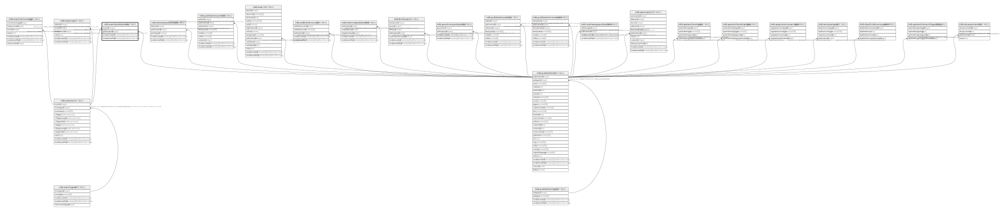

# ndb.eventpublications

## Description

## Columns

| # | Name            | Type                           | Default                      | Nullable | Children | Parents                                 | Comment |
| - | --------------- | ------------------------------ | ---------------------------- | -------- | -------- | --------------------------------------- | ------- |
| 1 | eventid         | integer                        |                              | false    |          | [ndb.events](ndb.events.md)             |         |
| 2 | publicationid   | integer                        |                              | false    |          | [ndb.publications](ndb.publications.md) |         |
| 3 | recdatecreated  | timestamp(0) without time zone | timezone('UTC'::text, now()) | false    |          |                                         |         |
| 4 | recdatemodified | timestamp(0) without time zone |                              | false    |          |                                         |         |

## Constraints

| # | Name                              | Type        | Definition                                                                                                 |
| - | --------------------------------- | ----------- | ---------------------------------------------------------------------------------------------------------- |
| 1 | eventpublications_pkey            | PRIMARY KEY | PRIMARY KEY (eventid, publicationid)                                                                       |
| 2 | fk_eventpublications_events       | FOREIGN KEY | FOREIGN KEY (eventid) REFERENCES ndb.events(eventid) ON UPDATE CASCADE ON DELETE CASCADE                   |
| 3 | fk_eventpublications_publications | FOREIGN KEY | FOREIGN KEY (publicationid) REFERENCES ndb.publications(publicationid) ON UPDATE CASCADE ON DELETE CASCADE |

## Indexes

| # | Name                   | Definition                                                                                               |
| - | ---------------------- | -------------------------------------------------------------------------------------------------------- |
| 1 | eventpublications_pkey | CREATE UNIQUE INDEX eventpublications_pkey ON ndb.eventpublications USING btree (eventid, publicationid) |

## Triggers

| # | Name                | Definition                                                                                                                                     |
| - | ------------------- | ---------------------------------------------------------------------------------------------------------------------------------------------- |
| 1 | tr_sites_modifydate | CREATE TRIGGER tr_sites_modifydate BEFORE INSERT OR UPDATE ON ndb.eventpublications FOR EACH ROW EXECUTE FUNCTION ndb.update_recdatemodified() |

## Relations

---

> Generated by [tbls](https://github.com/k1LoW/tbls)