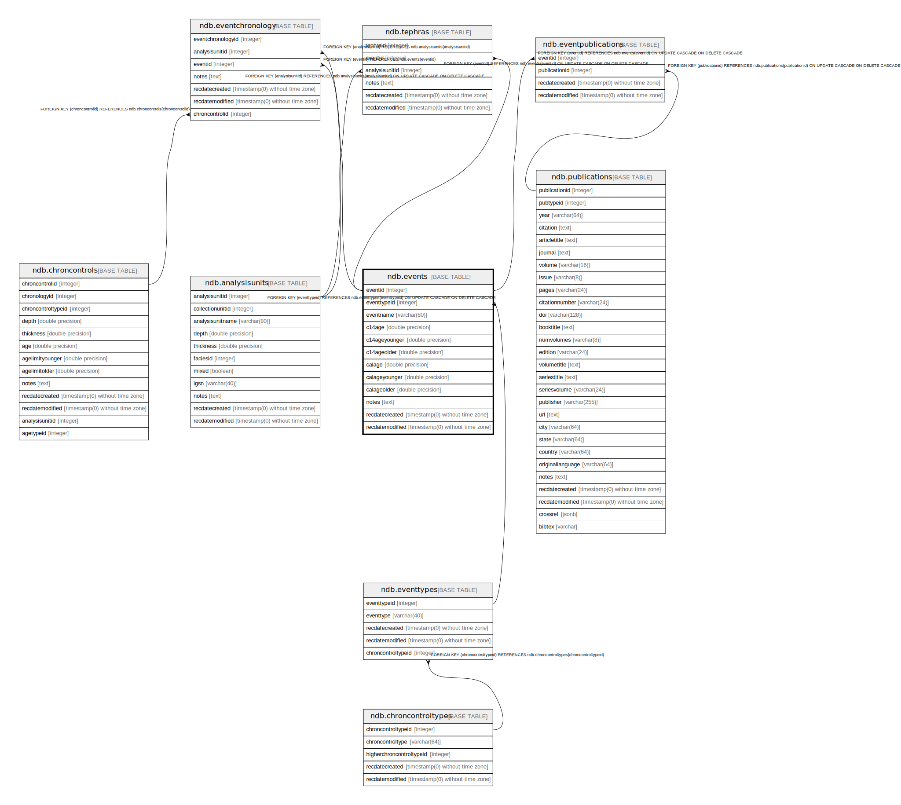

# ndb.events

## Description

## Columns

| #  | Name            | Type                           | Default                                     | Nullable | Children                                                                                                                      | Parents                             | Comment |
| -- | --------------- | ------------------------------ | ------------------------------------------- | -------- | ----------------------------------------------------------------------------------------------------------------------------- | ----------------------------------- | ------- |
| 1  | eventid         | integer                        | nextval('ndb.seq_events_eventid'::regclass) | false    | [ndb.eventchronology](ndb.eventchronology.md) [ndb.eventpublications](ndb.eventpublications.md) [ndb.tephras](ndb.tephras.md) |                                     |         |
| 2  | eventtypeid     | integer                        |                                             | false    |                                                                                                                               | [ndb.eventtypes](ndb.eventtypes.md) |         |
| 3  | eventname       | varchar(80)                    |                                             | false    |                                                                                                                               |                                     |         |
| 4  | c14age          | double precision               |                                             | true     |                                                                                                                               |                                     |         |
| 5  | c14ageyounger   | double precision               |                                             | true     |                                                                                                                               |                                     |         |
| 6  | c14ageolder     | double precision               |                                             | true     |                                                                                                                               |                                     |         |
| 7  | calage          | double precision               |                                             | true     |                                                                                                                               |                                     |         |
| 8  | calageyounger   | double precision               |                                             | true     |                                                                                                                               |                                     |         |
| 9  | calageolder     | double precision               |                                             | true     |                                                                                                                               |                                     |         |
| 10 | notes           | text                           |                                             | true     |                                                                                                                               |                                     |         |
| 11 | recdatecreated  | timestamp(0) without time zone | timezone('UTC'::text, now())                | false    |                                                                                                                               |                                     |         |
| 12 | recdatemodified | timestamp(0) without time zone |                                             | false    |                                                                                                                               |                                     |         |

## Constraints

| # | Name                 | Type        | Definition                                                                                           |
| - | -------------------- | ----------- | ---------------------------------------------------------------------------------------------------- |
| 1 | events_pkey          | PRIMARY KEY | PRIMARY KEY (eventid)                                                                                |
| 2 | fk_events_eventtypes | FOREIGN KEY | FOREIGN KEY (eventtypeid) REFERENCES ndb.eventtypes(eventtypeid) ON UPDATE CASCADE ON DELETE CASCADE |

## Indexes

| # | Name        | Definition                                                          |
| - | ----------- | ------------------------------------------------------------------- |
| 1 | events_pkey | CREATE UNIQUE INDEX events_pkey ON ndb.events USING btree (eventid) |

## Triggers

| # | Name                | Definition                                                                                                                          |
| - | ------------------- | ----------------------------------------------------------------------------------------------------------------------------------- |
| 1 | tr_sites_modifydate | CREATE TRIGGER tr_sites_modifydate BEFORE INSERT OR UPDATE ON ndb.events FOR EACH ROW EXECUTE FUNCTION ndb.update_recdatemodified() |

## Relations

---

> Generated by [tbls](https://github.com/k1LoW/tbls)