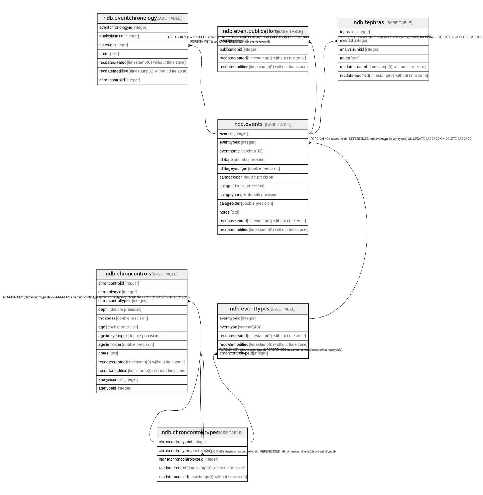

# ndb.eventtypes

## Description

## Columns

| # | Name               | Type                           | Default                                             | Nullable | Children                    | Parents                                           | Comment |
| - | ------------------ | ------------------------------ | --------------------------------------------------- | -------- | --------------------------- | ------------------------------------------------- | ------- |
| 1 | eventtypeid        | integer                        | nextval('ndb.seq_eventtypes_eventtypeid'::regclass) | false    | [ndb.events](ndb.events.md) |                                                   |         |
| 2 | eventtype          | varchar(40)                    |                                                     | false    |                             |                                                   |         |
| 3 | recdatecreated     | timestamp(0) without time zone | timezone('UTC'::text, now())                        | false    |                             |                                                   |         |
| 4 | recdatemodified    | timestamp(0) without time zone |                                                     | false    |                             |                                                   |         |
| 5 | chroncontroltypeid | integer                        |                                                     | true     |                             | [ndb.chroncontroltypes](ndb.chroncontroltypes.md) |         |

## Viewpoints

| Name                                      | Definition                           |
| ----------------------------------------- | ------------------------------------ |
| [Controlled Vocabularies](viewpoint-0.md) | Tables with controlled vocabularies. |

## Constraints

| # | Name            | Type        | Definition                                                                            |
| - | --------------- | ----------- | ------------------------------------------------------------------------------------- |
| 1 | evt_cct         | FOREIGN KEY | FOREIGN KEY (chroncontroltypeid) REFERENCES ndb.chroncontroltypes(chroncontroltypeid) |
| 2 | eventtypes_pkey | PRIMARY KEY | PRIMARY KEY (eventtypeid)                                                             |

## Indexes

| # | Name            | Definition                                                                      |
| - | --------------- | ------------------------------------------------------------------------------- |
| 1 | eventtypes_pkey | CREATE UNIQUE INDEX eventtypes_pkey ON ndb.eventtypes USING btree (eventtypeid) |

## Triggers

| # | Name                | Definition                                                                                                                              |
| - | ------------------- | --------------------------------------------------------------------------------------------------------------------------------------- |
| 1 | tr_sites_modifydate | CREATE TRIGGER tr_sites_modifydate BEFORE INSERT OR UPDATE ON ndb.eventtypes FOR EACH ROW EXECUTE FUNCTION ndb.update_recdatemodified() |

## Relations

---

> Generated by [tbls](https://github.com/k1LoW/tbls)