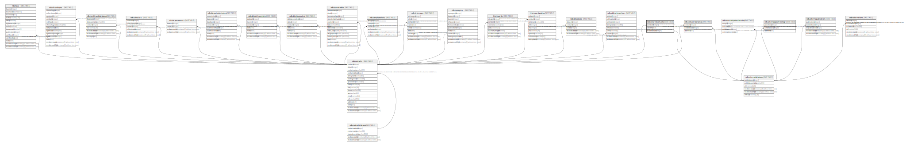

# ndb.externalcontacts

## Description

## Columns

| # | Name          | Type    | Default | Nullable | Children | Parents                                           | Comment |
| - | ------------- | ------- | ------- | -------- | -------- | ------------------------------------------------- | ------- |
| 1 | contactid     | integer |         | true     |          | [ndb.contacts](ndb.contacts.md)                   |         |
| 2 | identifier    | text    |         | true     |          |                                                   |         |
| 3 | extdatabaseid | integer |         | true     |          | [ndb.externaldatabases](ndb.externaldatabases.md) |         |

## Constraints

| # | Name                                                    | Type        | Definition                                                                  |
| - | ------------------------------------------------------- | ----------- | --------------------------------------------------------------------------- |
| 1 | externalcontacts_contactid_fkey                         | FOREIGN KEY | FOREIGN KEY (contactid) REFERENCES ndb.contacts(contactid)                  |
| 2 | externalcontacts_extdatabaseid_fkey                     | FOREIGN KEY | FOREIGN KEY (extdatabaseid) REFERENCES ndb.externaldatabases(extdatabaseid) |
| 3 | externalcontacts_contactid_identifier_extdatabaseid_key | UNIQUE      | UNIQUE (contactid, identifier, extdatabaseid)                               |

## Indexes

| # | Name                                                    | Definition                                                                                                                                             |
| - | ------------------------------------------------------- | ------------------------------------------------------------------------------------------------------------------------------------------------------ |
| 1 | externalcontacts_contactid_identifier_extdatabaseid_key | CREATE UNIQUE INDEX externalcontacts_contactid_identifier_extdatabaseid_key ON ndb.externalcontacts USING btree (contactid, identifier, extdatabaseid) |

## Relations

---

> Generated by [tbls](https://github.com/k1LoW/tbls)