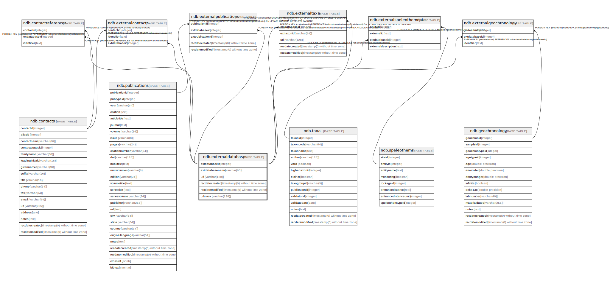

# ndb.externaldatabases

## Description

## Columns

| # | Name            | Type                           | Default                                                      | Nullable | Children                                                                                                                                                                                                                                                                                                                | Parents | Comment |
| - | --------------- | ------------------------------ | ------------------------------------------------------------ | -------- | ----------------------------------------------------------------------------------------------------------------------------------------------------------------------------------------------------------------------------------------------------------------------------------------------------------------------- | ------- | ------- |
| 1 | extdatabaseid   | integer                        | nextval('ndb.seq_externaldatabases_extdatabaseid'::regclass) | false    | [ndb.contactreferences](ndb.contactreferences.md) [ndb.externalpublications](ndb.externalpublications.md) [ndb.externaltaxa](ndb.externaltaxa.md) [ndb.externalspeleothemdata](ndb.externalspeleothemdata.md) [ndb.externalcontacts](ndb.externalcontacts.md) [ndb.externalgeochronology](ndb.externalgeochronology.md) |         |         |
| 2 | extdatabasename | varchar(80)                    |                                                              | false    |                                                                                                                                                                                                                                                                                                                         |         |         |
| 3 | url             | varchar(128)                   |                                                              | true     |                                                                                                                                                                                                                                                                                                                         |         |         |
| 4 | recdatecreated  | timestamp(0) without time zone | timezone('UTC'::text, now())                                 | false    |                                                                                                                                                                                                                                                                                                                         |         |         |
| 5 | recdatemodified | timestamp(0) without time zone |                                                              | false    |                                                                                                                                                                                                                                                                                                                         |         |         |
| 6 | urlmask         | varchar(128)                   |                                                              | true     |                                                                                                                                                                                                                                                                                                                         |         |         |

## Viewpoints

| Name                                      | Definition                           |
| ----------------------------------------- | ------------------------------------ |
| [Controlled Vocabularies](viewpoint-0.md) | Tables with controlled vocabularies. |

## Constraints

| # | Name                   | Type        | Definition                  |
| - | ---------------------- | ----------- | --------------------------- |
| 1 | externaldatabases_pkey | PRIMARY KEY | PRIMARY KEY (extdatabaseid) |

## Indexes

| # | Name                   | Definition                                                                                      |
| - | ---------------------- | ----------------------------------------------------------------------------------------------- |
| 1 | externaldatabases_pkey | CREATE UNIQUE INDEX externaldatabases_pkey ON ndb.externaldatabases USING btree (extdatabaseid) |

## Triggers

| # | Name                | Definition                                                                                                                                     |
| - | ------------------- | ---------------------------------------------------------------------------------------------------------------------------------------------- |
| 1 | tr_sites_modifydate | CREATE TRIGGER tr_sites_modifydate BEFORE INSERT OR UPDATE ON ndb.externaldatabases FOR EACH ROW EXECUTE FUNCTION ndb.update_recdatemodified() |

## Relations

---

> Generated by [tbls](https://github.com/k1LoW/tbls)