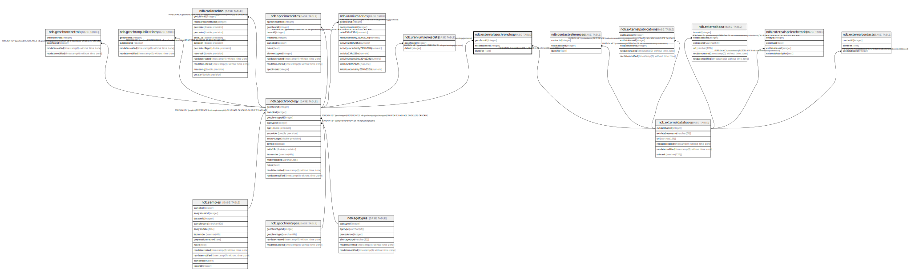

# ndb.externalgeochronology

## Description

## Columns

| # | Name          | Type    | Default | Nullable | Children | Parents                                           | Comment |
| - | ------------- | ------- | ------- | -------- | -------- | ------------------------------------------------- | ------- |
| 1 | extdatabaseid | integer |         | true     |          | [ndb.externaldatabases](ndb.externaldatabases.md) |         |
| 2 | geochronid    | integer |         | true     |          | [ndb.geochronology](ndb.geochronology.md)         |         |
| 3 | identifier    | text    |         | true     |          |                                                   |         |

## Viewpoints

| Name                                        | Definition                                        |
| ------------------------------------------- | ------------------------------------------------- |
| [Chronology related tables](viewpoint-5.md) | Tables related to chronology and age assignments. |

## Constraints

| # | Name                                     | Type        | Definition                                                                  |
| - | ---------------------------------------- | ----------- | --------------------------------------------------------------------------- |
| 1 | externalgeochronology_extdatabaseid_fkey | FOREIGN KEY | FOREIGN KEY (extdatabaseid) REFERENCES ndb.externaldatabases(extdatabaseid) |
| 2 | externalgeochronology_geochronid_fkey    | FOREIGN KEY | FOREIGN KEY (geochronid) REFERENCES ndb.geochronology(geochronid)           |
| 3 | uniqueid                                 | UNIQUE      | UNIQUE (geochronid, extdatabaseid, identifier)                              |

## Indexes

| # | Name     | Definition                                                                                                    |
| - | -------- | ------------------------------------------------------------------------------------------------------------- |
| 1 | uniqueid | CREATE UNIQUE INDEX uniqueid ON ndb.externalgeochronology USING btree (geochronid, extdatabaseid, identifier) |

## Relations

---

> Generated by [tbls](https://github.com/k1LoW/tbls)