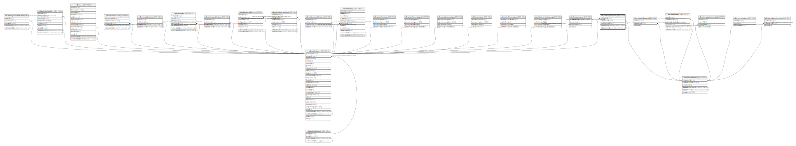

# ndb.externalpublications

## Description

## Columns

| # | Name             | Type                           | Default                      | Nullable | Children | Parents                                           | Comment |
| - | ---------------- | ------------------------------ | ---------------------------- | -------- | -------- | ------------------------------------------------- | ------- |
| 1 | publicationid    | integer                        |                              | false    |          | [ndb.publications](ndb.publications.md)           |         |
| 2 | extdatabaseid    | integer                        |                              | false    |          | [ndb.externaldatabases](ndb.externaldatabases.md) |         |
| 3 | extpublicationid | integer                        |                              | false    |          |                                                   |         |
| 4 | recdatecreated   | timestamp(0) without time zone | timezone('UTC'::text, now()) | false    |          |                                                   |         |
| 5 | recdatemodified  | timestamp(0) without time zone |                              | false    |          |                                                   |         |

## Constraints

| # | Name                                      | Type        | Definition                                                                                                      |
| - | ----------------------------------------- | ----------- | --------------------------------------------------------------------------------------------------------------- |
| 1 | fk_externalpublications_externaldatabases | FOREIGN KEY | FOREIGN KEY (extdatabaseid) REFERENCES ndb.externaldatabases(extdatabaseid) ON UPDATE CASCADE ON DELETE CASCADE |
| 2 | externalpublications_pkey                 | PRIMARY KEY | PRIMARY KEY (publicationid, extdatabaseid)                                                                      |
| 3 | fk_externalpublications_publications      | FOREIGN KEY | FOREIGN KEY (publicationid) REFERENCES ndb.publications(publicationid) ON UPDATE CASCADE ON DELETE CASCADE      |

## Indexes

| # | Name                      | Definition                                                                                                           |
| - | ------------------------- | -------------------------------------------------------------------------------------------------------------------- |
| 1 | externalpublications_pkey | CREATE UNIQUE INDEX externalpublications_pkey ON ndb.externalpublications USING btree (publicationid, extdatabaseid) |

## Triggers

| # | Name                | Definition                                                                                                                                        |
| - | ------------------- | ------------------------------------------------------------------------------------------------------------------------------------------------- |
| 1 | tr_sites_modifydate | CREATE TRIGGER tr_sites_modifydate BEFORE INSERT OR UPDATE ON ndb.externalpublications FOR EACH ROW EXECUTE FUNCTION ndb.update_recdatemodified() |

## Relations

---

> Generated by [tbls](https://github.com/k1LoW/tbls)