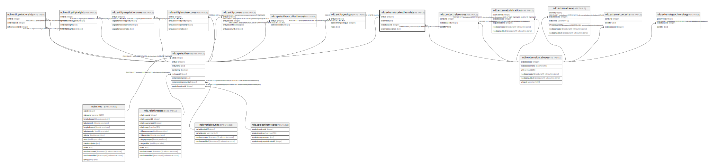

# ndb.externalspeleothemdata

## Description

## Columns

| # | Name                | Type    | Default | Nullable | Children | Parents                                           | Comment |
| - | ------------------- | ------- | ------- | -------- | -------- | ------------------------------------------------- | ------- |
| 1 | entityid            | integer |         | true     |          | [ndb.speleothems](ndb.speleothems.md)             |         |
| 2 | extdatabaseid       | integer |         | true     |          | [ndb.externaldatabases](ndb.externaldatabases.md) |         |
| 3 | externaldescription | text    |         | true     |          |                                                   |         |
| 4 | externalid          | text    |         | true     |          |                                                   |         |

## Constraints

| # | Name                                      | Type        | Definition                                                                    |
| - | ----------------------------------------- | ----------- | ----------------------------------------------------------------------------- |
| 1 | externalspeleothemdata_entityid_fkey      | FOREIGN KEY | FOREIGN KEY (entityid) REFERENCES ndb.speleothems(entityid) ON DELETE CASCADE |
| 2 | externalspeleothemdata_extdatabaseid_fkey | FOREIGN KEY | FOREIGN KEY (extdatabaseid) REFERENCES ndb.externaldatabases(extdatabaseid)   |

## Relations

---

> Generated by [tbls](https://github.com/k1LoW/tbls)