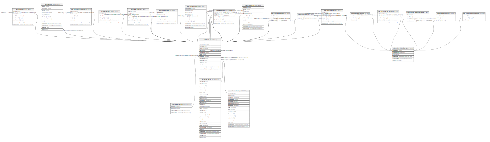

# ndb.externaltaxa

## Description

## Columns

| # | Name            | Type                           | Default                      | Nullable | Children | Parents                                           | Comment |
| - | --------------- | ------------------------------ | ---------------------------- | -------- | -------- | ------------------------------------------------- | ------- |
| 1 | taxonid         | integer                        |                              | false    |          | [ndb.taxa](ndb.taxa.md)                           |         |
| 2 | extdatabaseid   | integer                        |                              | false    |          | [ndb.externaldatabases](ndb.externaldatabases.md) |         |
| 3 | exttaxonid      | varchar(64)                    |                              | false    |          |                                                   |         |
| 4 | url             | varchar(128)                   |                              | true     |          |                                                   |         |
| 5 | recdatecreated  | timestamp(0) without time zone | timezone('UTC'::text, now()) | false    |          |                                                   |         |
| 6 | recdatemodified | timestamp(0) without time zone |                              | false    |          |                                                   |         |

## Viewpoints

| Name                               | Definition                                             |
| ---------------------------------- | ------------------------------------------------------ |
| [Taxonomic Tables](viewpoint-2.md) | Tables related to species, observations and specimens. |

## Constraints

| # | Name                              | Type        | Definition                                                                                                      |
| - | --------------------------------- | ----------- | --------------------------------------------------------------------------------------------------------------- |
| 1 | fk_externaltaxa_externaldatabases | FOREIGN KEY | FOREIGN KEY (extdatabaseid) REFERENCES ndb.externaldatabases(extdatabaseid) ON UPDATE CASCADE ON DELETE CASCADE |
| 2 | externaltaxa_pkey                 | PRIMARY KEY | PRIMARY KEY (taxonid, extdatabaseid, exttaxonid)                                                                |
| 3 | fk_externaltaxa_taxa              | FOREIGN KEY | FOREIGN KEY (taxonid) REFERENCES ndb.taxa(taxonid) ON UPDATE CASCADE ON DELETE CASCADE                          |

## Indexes

| # | Name                                     | Definition                                                                                                                               |
| - | ---------------------------------------- | ---------------------------------------------------------------------------------------------------------------------------------------- |
| 1 | externaltaxa_pkey                        | CREATE UNIQUE INDEX externaltaxa_pkey ON ndb.externaltaxa USING btree (taxonid, extdatabaseid, exttaxonid)                               |
| 2 | ix_extdatabaseid_exttaxonid_externaltaxa | CREATE INDEX ix_extdatabaseid_exttaxonid_externaltaxa ON ndb.externaltaxa USING btree (extdatabaseid, exttaxonid) WITH (fillfactor='10') |

## Triggers

| # | Name                | Definition                                                                                                                                |
| - | ------------------- | ----------------------------------------------------------------------------------------------------------------------------------------- |
| 1 | tr_sites_modifydate | CREATE TRIGGER tr_sites_modifydate BEFORE INSERT OR UPDATE ON ndb.externaltaxa FOR EACH ROW EXECUTE FUNCTION ndb.update_recdatemodified() |

## Relations

---

> Generated by [tbls](https://github.com/k1LoW/tbls)