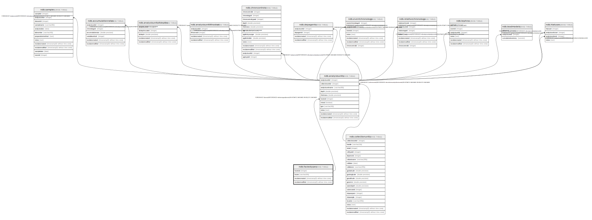

# ndb.faciestypes

## Description

Lookup table of Facies Types. Table is referenced by the AnalysisUnits table.

## Columns

| # | Name            | Type                           | Default                                           | Nullable | Children                                  | Parents | Comment                                    |
| - | --------------- | ------------------------------ | ------------------------------------------------- | -------- | ----------------------------------------- | ------- | ------------------------------------------ |
| 1 | faciesid        | integer                        | nextval('ndb.seq_faciestypes_faciesid'::regclass) | false    | [ndb.analysisunits](ndb.analysisunits.md) |         | An arbitrary Facies identification number. |
| 2 | facies          | varchar(64)                    |                                                   | false    |                                           |         | Short Facies description.                  |
| 3 | recdatecreated  | timestamp(0) without time zone | timezone('UTC'::text, now())                      | false    |                                           |         |                                            |
| 4 | recdatemodified | timestamp(0) without time zone |                                                   | false    |                                           |         |                                            |

## Constraints

| # | Name             | Type        | Definition             |
| - | ---------------- | ----------- | ---------------------- |
| 1 | faciestypes_pkey | PRIMARY KEY | PRIMARY KEY (faciesid) |

## Indexes

| # | Name             | Definition                                                                     |
| - | ---------------- | ------------------------------------------------------------------------------ |
| 1 | faciestypes_pkey | CREATE UNIQUE INDEX faciestypes_pkey ON ndb.faciestypes USING btree (faciesid) |

## Triggers

| # | Name                | Definition                                                                                                                               |
| - | ------------------- | ---------------------------------------------------------------------------------------------------------------------------------------- |
| 1 | tr_sites_modifydate | CREATE TRIGGER tr_sites_modifydate BEFORE INSERT OR UPDATE ON ndb.faciestypes FOR EACH ROW EXECUTE FUNCTION ndb.update_recdatemodified() |

## Relations

---

> Generated by [tbls](https://github.com/k1LoW/tbls)